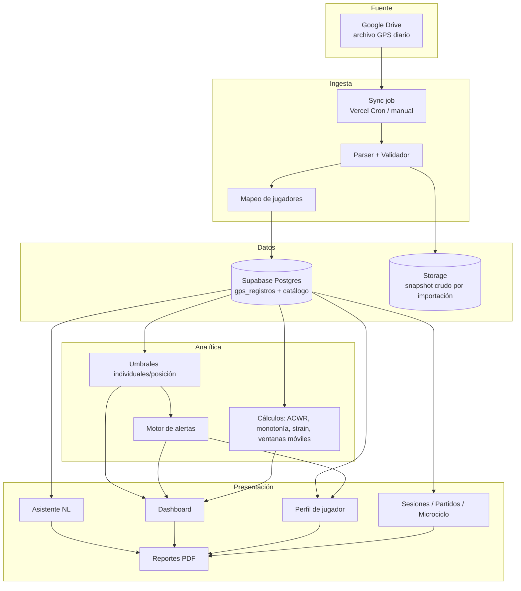
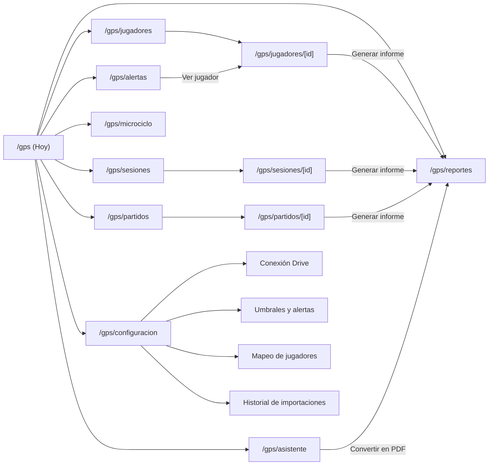
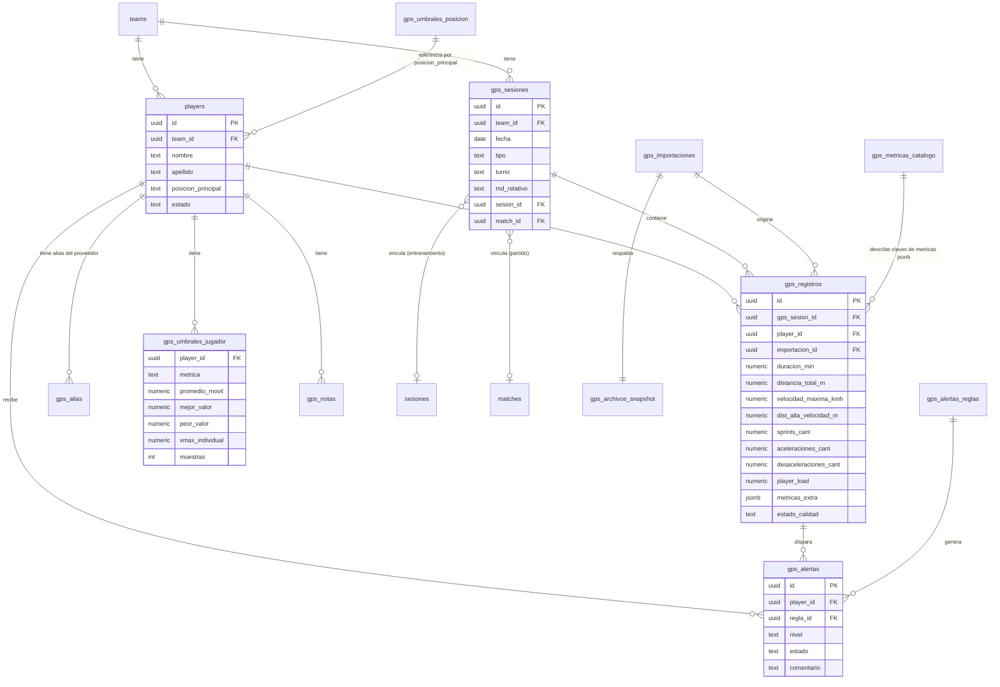
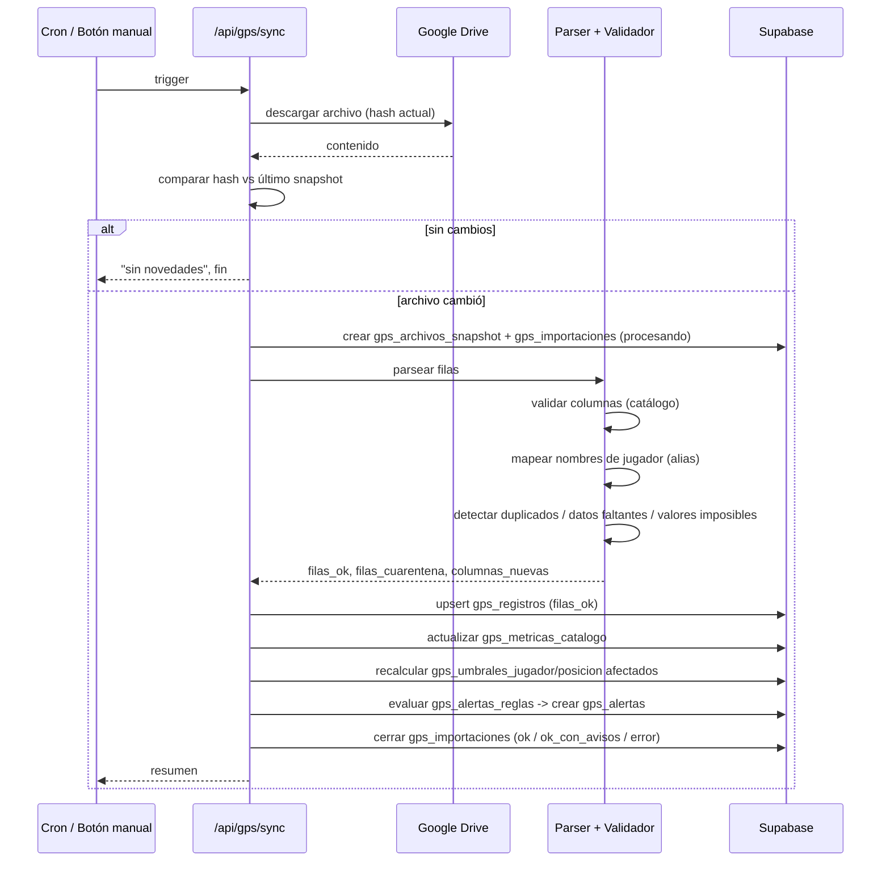
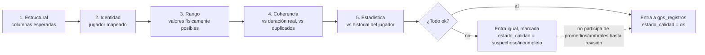
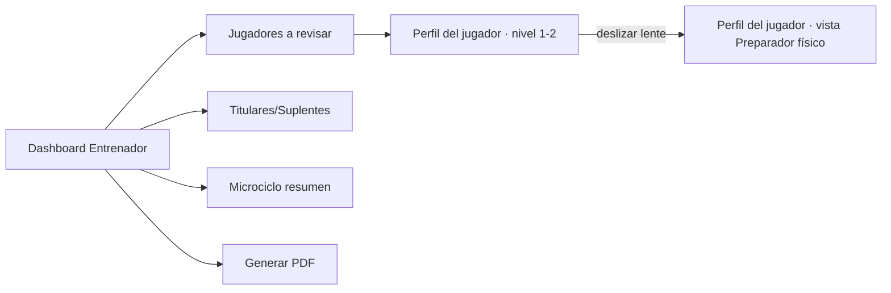
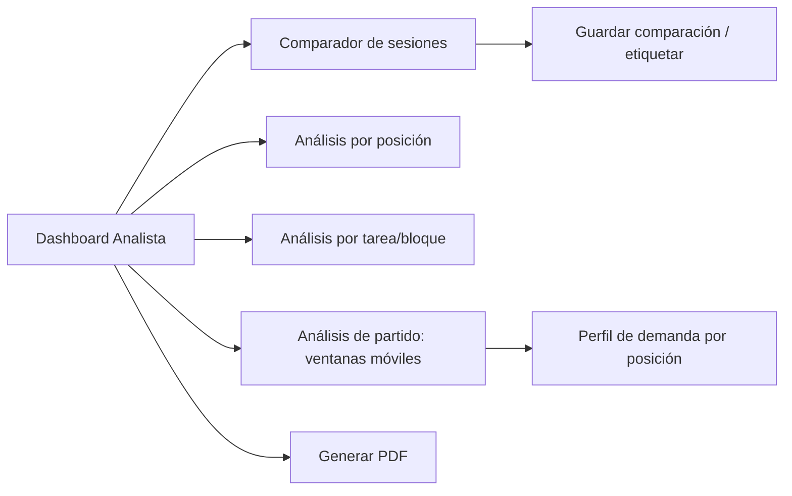
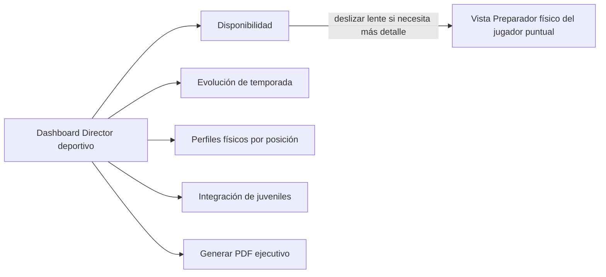
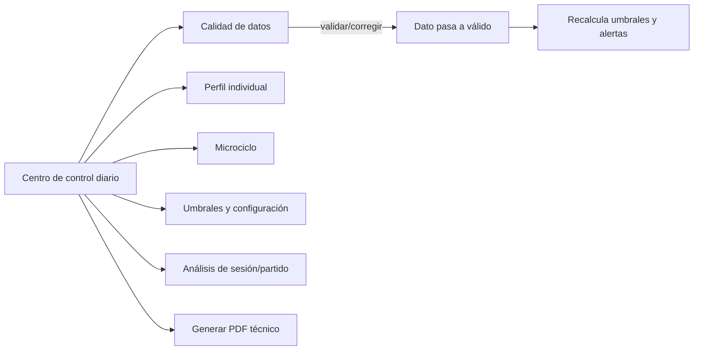
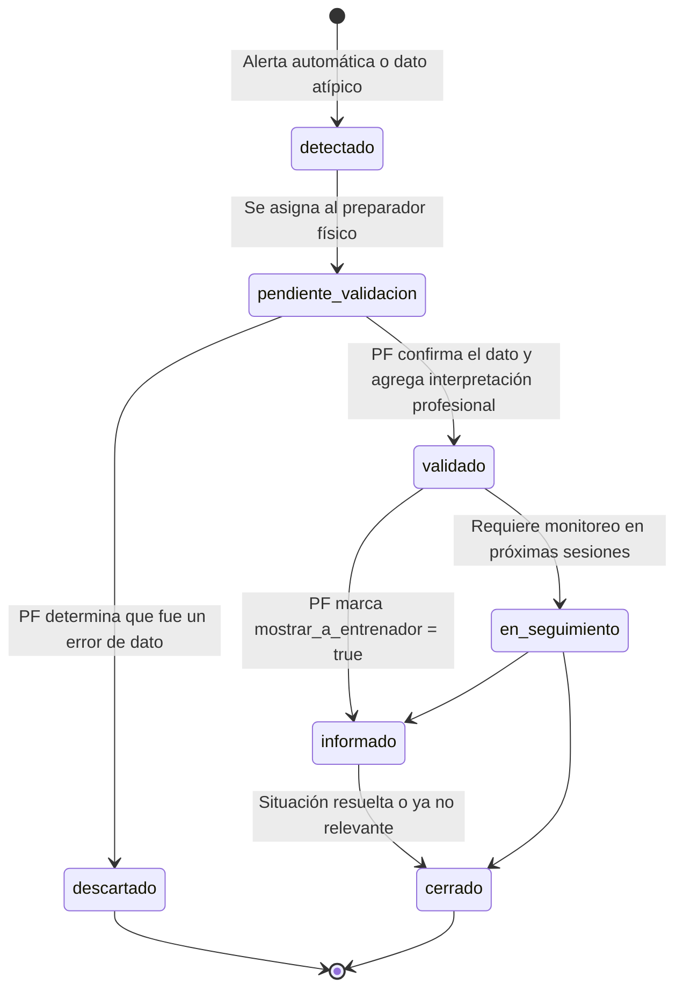

# Módulo GPS — Diseño funcional, técnico y analítico

Propuesta elaborada como equipo multidisciplinario (arquitectura de software, rendimiento físico, ciencia de datos GPS, UX/UI, generación de reportes) para incorporar el módulo **GPS** a la plataforma de Nacional.

Este documento está pensado para entregarse a producto, diseño y desarrollo como base de implementación. Todo lo que se describe está **anclado al código y esquema ya existentes** del proyecto (no es una propuesta genérica): se referencian tablas reales (`players`, `teams`, `staff_users`, `matches`, `sesiones`), el patrón real de integración con Google (`src/lib/google-auth.ts`, `src/lib/google-drive.ts`), la librería de PDF real (`@react-pdf/renderer` + `src/lib/pdf-theme.ts`) y la convención real de migraciones (`supabase/migrations/*.sql`, RLS con `current_team_id()`).

> Nota transversal: cualquier fórmula, umbral o zona de velocidad que dependa del **proveedor GPS, modelo de dispositivo o configuración de zonas** se marca explícitamente como "☑ a confirmar con el proveedor" a lo largo del documento. No se hardcodean supuestos.

---

## Índice

1. [Resumen ejecutivo](#1-resumen-ejecutivo)
2. [Objetivos del módulo](#2-objetivos-del-módulo)
3. [Arquitectura general](#3-arquitectura-general)
4. [Mapa de navegación](#4-mapa-de-navegación)
5. [Modelo de datos](#5-modelo-de-datos)
6. [Flujo de integración con Google Drive](#6-flujo-de-integración-con-google-drive)
7. [Proceso de validación de datos](#7-proceso-de-validación-de-datos)
8. [Diccionario de métricas](#8-diccionario-de-métricas)
9. [Umbrales individuales y por posición](#9-umbrales-individuales-y-por-posición)
10. [Diseño del dashboard principal](#10-diseño-del-dashboard-principal)
11. [Diseño del perfil de jugador](#11-diseño-del-perfil-de-jugador)
12. [Diseño del análisis de sesiones](#12-diseño-del-análisis-de-sesiones)
13. [Análisis de partidos](#13-análisis-de-partidos)
14. [Diseño del microciclo](#14-diseño-del-microciclo)
15. [Sistema de alertas](#15-sistema-de-alertas)
16. [Asistente de consultas](#16-asistente-de-consultas)
17. [Reportes y exportación a PDF](#17-reportes-y-exportación-a-pdf)
18. [Roles y experiencia por rol](#18-roles-y-experiencia-por-rol)
19. [Recomendaciones de UX/UI](#19-recomendaciones-de-uxui)
20. [Arquitectura técnica sugerida](#20-arquitectura-técnica-sugerida)
21. [Plan de implementación por fases](#21-plan-de-implementación-por-fases)
22. [Riesgos y limitaciones](#22-riesgos-y-limitaciones)
23. [Ideas adicionales](#23-ideas-adicionales)
24. [Lista priorizada de funcionalidades](#24-lista-priorizada-de-funcionalidades)

---

## 1. Resumen ejecutivo

El módulo GPS convierte un archivo de Google Drive que hoy se actualiza a mano y se mira "en crudo" en una sección propia de la plataforma que responde, todos los días, cuatro preguntas: **¿qué pasó hoy?, ¿quién cargó de más o de menos?, ¿qué se sale de lo habitual?, ¿cómo llega cada jugador al próximo partido?**

Tres decisiones de diseño sostienen todo lo demás:

1. **Los datos crudos GPS se guardan tal cual llegan (JSONB) + un núcleo de métricas normalizadas** para los cálculos rápidos (tabla `gps_registros`). Así el sistema nunca asume qué métricas trae el proveedor: muestra las que hay, sin inventar columnas vacías.
2. **Los umbrales son siempre individuales o por posición, nunca un número fijo para todo el plantel.** Se calculan con el propio historial del jugador (promedio móvil, mejor/peor valor, % de su velocidad máxima personal) y con un fallback explícito mientras no hay historial suficiente.
3. **El sistema señala, no diagnostica.** Toda alerta se redacta como "está por encima de su rango habitual, revisar con el área de rendimiento", nunca como "está en riesgo de lesión". Esto se aplica en las alertas, en el asistente de lenguaje natural y en los PDF.

Reutiliza infraestructura ya construida en este proyecto (no se agregan dependencias nuevas para el 90% del alcance):

| Necesidad | Ya existe en el proyecto |
|---|---|
| Autenticación con Google (service account, JWT) | `src/lib/google-auth.ts` |
| Descarga de archivos de Drive | `src/lib/google-drive.ts` |
| Lectura de Google Sheets | `fetchSheetValues()` en `google-auth.ts` |
| Parseo de Excel/CSV | paquete `xlsx` (ya instalado) |
| Generación de PDF con estilo de club | `@react-pdf/renderer` + `src/lib/pdf-theme.ts` |
| Gráficos | `recharts` (ya instalado) |
| Multi-tenant por equipo con RLS | función `current_team_id()` en Postgres |
| Roles de staff y lentes de vista | `staff_users.rol` + `gps_preferencias_usuario.rol_vista` (ver sección 18) |

---

## 2. Objetivos del módulo

| # | Objetivo | Cómo se mide |
|---|---|---|
| O1 | Centralizar los datos GPS de entrenamientos, partidos y sesiones individuales/colectivas en la plataforma | 100% de las sesiones del archivo de Drive importadas sin intervención manual |
| O2 | Que un usuario no especialista entienda en <30 segundos qué pasó en la última sesión | Dashboard con máximo 6 tarjetas + semáforo, sin jerga sin explicar |
| O3 | Detectar automáticamente desviaciones relevantes de carga por jugador | Motor de alertas configurable con umbrales individuales/posición |
| O4 | Dar contexto de cómo llega cada jugador al próximo partido | Sección "Disponibilidad y carga reciente" en perfil de jugador |
| O5 | Permitir a preparación física y análisis trabajar con el detalle completo | Vista avanzada con ventanas móviles, ACWR, monotonía/strain, exportación |
| O6 | Generar reportes profesionales listos para compartir | Sistema de PDF con plantillas por audiencia (entrenador, PF, dirección) |
| O7 | Que la carga de un archivo roto o incompleto no contamine el histórico | Cuarentena de datos sospechosos + validación en la importación |
| O8 | Escalar a futuras fuentes (wellness, RPE, fuerza, video) sin rehacer el módulo | Modelo de datos desacoplado por dominio (ver sección 20) |

---

## 3. Arquitectura general

### 3.1 Estructura de navegación

```
GPS (ítem de menú principal, mismo nivel que "Métricas de Rendimiento")
├── Hoy (pantalla principal / dashboard)
├── Jugadores
│   └── [jugador] → Perfil individual
├── Sesiones
│   └── [sesión] → Análisis de sesión
├── Partidos
│   └── [partido] → Análisis de partido
├── Microciclo
│   └── Vista semanal (matriz jugador x día)
├── Alertas
│   └── Bandeja de revisión + historial
├── Asistente
│   └── Consultas en lenguaje natural
├── Reportes
│   └── Generador de PDF + plantillas + programados
└── Configuración GPS
    ├── Conexión con Drive (estado, última sync, sincronizar ahora)
    ├── Umbrales y alertas (reglas)
    ├── Mapeo de jugadores
    └── Historial de importaciones
```

### 3.2 Jerarquía de información (de lo general a lo particular)

`Equipo (hoy) → Sesión/Partido → Grupo o posición → Jugador → Métrica puntual`

El usuario siempre entra por el nivel más general (**Hoy**) y **hace clic para bajar** de nivel, nunca al revés. Esto es clave para que un usuario no especialista no se pierda: nunca aterriza en una tabla de números sin antes ver un resumen con semáforo.

### 3.3 Vistas por rol (resumen; ficha completa en sección 18)

El módulo ofrece **4 lentes de vista**, seleccionables libremente con un control deslizable siempre visible (sección 18.2): Entrenador principal, Analista de rendimiento, Preparador físico, Director deportivo.

| | Lente sugerida por defecto |
|---|---|
| Entrenador principal / asistente técnico / utilero | Entrenador principal |
| Preparador físico / médico / fisioterapeuta | Preparador físico |
| Analista de scouting | Analista de rendimiento |
| Admin | Entrenador principal (ajustable) |

Cualquier usuario puede deslizar a cualquiera de las 4 lentes en cualquier momento — la lente es una preferencia de presentación, no un permiso (sección 18.1).

### 3.4 Cómo la arquitectura responde a las preguntas del brief

| Pregunta | Dónde se responde |
|---|---|
| ¿Qué pasó hoy? | Tarjeta "Resumen de hoy" en el dashboard |
| ¿Quién tuvo mayor/menor carga? | Ranking de carga del dashboard + matriz del microciclo |
| ¿Qué valores están fuera de lo habitual? | Tarjeta "Fuera de rango" + motor de alertas |
| ¿Quién requiere seguimiento? | Bandeja de alertas + semáforo en perfil de jugador |
| ¿Cómo se compara una sesión con otras? | Análisis de sesiones → comparar sesiones |
| ¿Cómo se compara la semana con anteriores? | Vista de microciclo → comparación histórica |
| ¿Cómo llega cada jugador al próximo partido? | Perfil de jugador → "Disponibilidad y carga reciente" |

### 3.5 Diagrama de arquitectura funcional



---

## 4. Mapa de navegación



**Filtros generales** (persistentes en toda la sección, tipo barra superior): rango de fechas, competencia/microciclo, posición, jugador(es), tipo de sesión (entrenamiento/partido/individual/colectiva), vista simple/avanzada.

---

## 5. Modelo de datos

### 5.1 Diagrama entidad-relación



### 5.2 Tablas (DDL de referencia, siguiendo la convención real del proyecto)

> Sigue el estilo exacto de las migraciones existentes: `team_id` + RLS con `current_team_id()`, `uuid` con `gen_random_uuid()`, snake_case. Este DDL es la base para la migración real cuando se implemente (no se aplica en esta entrega, es propuesta).

```sql
-- Catálogo dinámico de métricas: qué columnas trae el archivo hoy.
-- Se actualiza solo en cada importación (ver sección 6/7).
create table gps_metricas_catalogo (
  id uuid primary key default gen_random_uuid(),
  team_id uuid not null references teams (id) on delete cascade,
  clave text not null,              -- ej "hsr_distance_m" (como viene del proveedor)
  nombre_simple text,               -- ej "Distancia a alta velocidad"
  nombres_por_rol jsonb not null default '{}'::jsonb,  -- ej {"entrenador_principal": "Exposición a velocidad máxima"} (sección 18.6)
  unidad text,
  activa boolean not null default true,
  primera_vez_visto date not null default current_date,
  ultima_vez_visto date not null default current_date,
  unique (team_id, clave)
);

-- Snapshot crudo del archivo en cada importación (para poder revertir).
create table gps_archivos_snapshot (
  id uuid primary key default gen_random_uuid(),
  team_id uuid not null references teams (id) on delete cascade,
  storage_path text not null,       -- bucket "gps-snapshots"
  hash_contenido text not null,
  filas int not null,
  columnas text[] not null,
  created_at timestamptz not null default now()
);

-- Historial de importaciones (éxito/error, quién y cuándo).
create table gps_importaciones (
  id uuid primary key default gen_random_uuid(),
  team_id uuid not null references teams (id) on delete cascade,
  snapshot_id uuid references gps_archivos_snapshot (id),
  origen text not null check (origen in ('automatica', 'manual')),
  iniciada_por uuid references staff_users (id),
  estado text not null check (estado in ('procesando', 'ok', 'ok_con_avisos', 'error')),
  filas_nuevas int not null default 0,
  filas_actualizadas int not null default 0,
  filas_en_cuarentena int not null default 0,
  columnas_nuevas text[] not null default '{}',
  columnas_faltantes text[] not null default '{}',
  detalle jsonb,
  started_at timestamptz not null default now(),
  finished_at timestamptz
);

-- Alias de nombres del proveedor GPS -> jugador real.
create table gps_alias (
  id uuid primary key default gen_random_uuid(),
  team_id uuid not null references teams (id) on delete cascade,
  nombre_proveedor text not null,
  player_id uuid references players (id) on delete set null,
  confirmado boolean not null default false,
  unique (team_id, nombre_proveedor)
);

-- Sesión trackeable: entrenamiento, partido, individual o colectiva.
create table gps_sesiones (
  id uuid primary key default gen_random_uuid(),
  team_id uuid not null references teams (id) on delete cascade,
  fecha date not null,
  tipo text not null check (tipo in ('entrenamiento', 'partido', 'individual')),
  modalidad text not null default 'colectiva' check (modalidad in ('colectiva', 'individual')),
  turno text check (turno in ('M', 'V')),
  md_relativo text,                 -- 'MD', 'MD+1', 'MD-2', etc. (ver sección 13)
  sesion_id uuid references sesiones (id) on delete set null,   -- link a planificación existente
  match_id uuid references matches (id) on delete set null,     -- link a partidos existente
  nombre_bloque text,               -- si el proveedor separa por bloques/tareas
  created_at timestamptz not null default now(),
  unique (team_id, fecha, turno, modalidad, nombre_bloque)
);

-- Registro GPS de un jugador en una sesión: núcleo normalizado + resto en JSONB.
create table gps_registros (
  id uuid primary key default gen_random_uuid(),
  gps_sesion_id uuid not null references gps_sesiones (id) on delete cascade,
  player_id uuid not null references players (id) on delete cascade,
  importacion_id uuid not null references gps_importaciones (id),
  duracion_min numeric,
  distancia_total_m numeric,
  distancia_por_min numeric,
  velocidad_maxima_kmh numeric,
  porcentaje_vmax_individual numeric,
  dist_alta_velocidad_m numeric,     -- ☑ umbral de "alta velocidad" a confirmar con proveedor
  dist_muy_alta_velocidad_m numeric,
  sprint_distancia_m numeric,
  sprints_cant int,
  aceleraciones_cant int,
  desaceleraciones_cant int,
  aceleraciones_intensas_cant int,
  desaceleraciones_intensas_cant int,
  player_load numeric,
  metricas_extra jsonb not null default '{}'::jsonb,  -- todo lo que el core no modela
  estado_calidad text not null default 'ok' check (estado_calidad in ('ok', 'sospechoso', 'incompleto', 'sin_dispositivo')),
  created_at timestamptz not null default now(),
  unique (gps_sesion_id, player_id)
);

-- Umbrales y referencia individual (se recalculan periódicamente, ver sección 6).
create table gps_umbrales_jugador (
  player_id uuid not null references players (id) on delete cascade,
  metrica text not null,
  promedio_movil_28d numeric,
  desvio_28d numeric,
  mejor_valor numeric,
  peor_valor numeric,
  vmax_individual numeric,           -- velocidad máxima histórica del jugador
  muestras int not null default 0,
  actualizado_at timestamptz not null default now(),
  primary key (player_id, metrica)
);

-- Referencia por posición (agregado del plantel, uso como fallback).
create table gps_umbrales_posicion (
  team_id uuid not null references teams (id) on delete cascade,
  posicion text not null,
  metrica text not null,
  promedio numeric,
  desvio numeric,
  muestras int not null default 0,
  actualizado_at timestamptz not null default now(),
  primary key (team_id, posicion, metrica)
);

-- Reglas de alertas, configurables por equipo.
create table gps_alertas_reglas (
  id uuid primary key default gen_random_uuid(),
  team_id uuid not null references teams (id) on delete cascade,
  codigo text not null,              -- ej "carga_superior_promedio"
  nombre text not null,
  activa boolean not null default true,
  prioridad text not null check (prioridad in ('baja', 'media', 'alta')),
  parametros jsonb not null default '{}'::jsonb,  -- ej {"desvios": 1.5, "ventana_dias": 28}
  unique (team_id, codigo)
);

-- Instancias de alerta generadas.
create table gps_alertas (
  id uuid primary key default gen_random_uuid(),
  team_id uuid not null references teams (id) on delete cascade,
  regla_id uuid not null references gps_alertas_reglas (id),
  player_id uuid references players (id) on delete cascade,
  gps_sesion_id uuid references gps_sesiones (id) on delete cascade,
  nivel text not null check (nivel in ('info', 'atencion', 'prioritaria')),
  mensaje text not null,             -- redactado como aviso, nunca diagnóstico (ver sección 15)
  datos jsonb,
  estado text not null default 'pendiente' check (estado in ('pendiente', 'revisada', 'descartada')),
  revisada_por uuid references staff_users (id),
  comentario text,
  created_at timestamptz not null default now(),
  revisada_at timestamptz
);

-- Notas generales del cuerpo técnico (no médicas) sobre un jugador/sesión.
create table gps_notas (
  id uuid primary key default gen_random_uuid(),
  team_id uuid not null references teams (id) on delete cascade,
  player_id uuid references players (id) on delete cascade,
  gps_sesion_id uuid references gps_sesiones (id) on delete cascade,
  autor_id uuid not null references staff_users (id),
  texto text not null,
  created_at timestamptz not null default now()
);

-- Notas médicas: tabla separada, RLS distinta (solo médico/admin). Ver sección 18.
create table gps_notas_medicas (
  id uuid primary key default gen_random_uuid(),
  team_id uuid not null references teams (id) on delete cascade,
  player_id uuid not null references players (id) on delete cascade,
  autor_id uuid not null references staff_users (id),
  texto text not null,
  created_at timestamptz not null default now()
);

-- Preferencia de "lente" (rol de vista) y personalización por usuario. Ver sección 18.
-- El rol de vista es independiente del rol de autenticación (staff_users.rol): cualquier
-- usuario autorizado puede elegir con qué lente mirar el módulo (sección 18.2).
create table gps_preferencias_usuario (
  staff_user_id uuid primary key references staff_users (id) on delete cascade,
  rol_vista text not null default 'entrenador_principal' check (
    rol_vista in ('entrenador_principal', 'analista_rendimiento', 'preparador_fisico', 'director_deportivo')
  ),
  orden_tarjetas text[],
  metricas_ocultas text[] not null default '{}',
  jugadores_favoritos uuid[] not null default '{}',
  grupos_guardados jsonb not null default '[]'::jsonb,
  periodo_default text not null default '7d',
  actualizado_at timestamptz not null default now()
);

-- Flujo de comunicación entre roles: una desviación detectada pasa por estados hasta
-- quedar cerrada, y cada rol ve una versión del mismo hallazgo con distinto nivel de
-- detalle (sección 18.7). No reemplaza a gps_alertas (que es el disparador automático);
-- una observación puede o no originarse en una alerta.
create table gps_observaciones (
  id uuid primary key default gen_random_uuid(),
  team_id uuid not null references teams (id) on delete cascade,
  alerta_id uuid references gps_alertas (id) on delete set null,
  player_id uuid references players (id) on delete cascade,
  gps_sesion_id uuid references gps_sesiones (id) on delete cascade,
  metrica text,
  autor_id uuid not null references staff_users (id),
  comentario text not null,
  interpretacion_profesional text,
  nivel_privacidad text not null default 'equipo' check (nivel_privacidad in ('equipo', 'medico', 'privado')),
  roles_autorizados text[] not null default '{entrenador_principal,analista_rendimiento,preparador_fisico,director_deportivo}',
  mostrar_a_entrenador boolean not null default false,
  estado text not null default 'detectado' check (
    estado in ('detectado', 'pendiente_validacion', 'validado', 'en_seguimiento', 'informado', 'cerrado')
  ),
  created_at timestamptz not null default now(),
  updated_at timestamptz not null default now()
);
```

### 5.3 Entidades solicitadas → dónde viven

| Entidad pedida | Cómo se resuelve |
|---|---|
| Jugador / Equipo / Plantel | `players`, `teams` (ya existen) |
| Sesión / Entrenamiento | `gps_sesiones` (tipo='entrenamiento'), vinculada a `sesiones` si hay planificación cargada |
| Partido | `gps_sesiones` (tipo='partido') vinculada a `matches` |
| Fecha / Microciclo / Semana | `gps_sesiones.fecha` + `md_relativo`; el "microciclo" es una vista computada agrupando por semana relativa al próximo/último partido, no una tabla propia |
| Temporada / Competición | Ya viven en `teams.temporada` y `matches.competencia` |
| Rival | Ya existe `rivales` / `matches.rival` |
| Posición | `players.posicion_principal` (ya existe) |
| Estado físico / Disponibilidad | `players.estado` (activo/cedido/baja) + capa de disponibilidad diaria (se propone sumar a `sesiones.jugadores_estado`, que ya existe como jsonb, en vez de duplicar) |
| Lesión | Fuera de alcance de GPS (pertenece a un futuro módulo médico); GPS solo **señala** desviaciones, no registra diagnósticos |
| Tipo de tarea / Bloque | `gps_sesiones.nombre_bloque` |
| Datos GPS | `gps_registros` |
| Umbrales / Referencias | `gps_umbrales_jugador`, `gps_umbrales_posicion` |
| Alertas | `gps_alertas_reglas`, `gps_alertas` |
| Informes | Se reutiliza el patrón de generación (React-PDF) sin tabla nueva; opcionalmente `gps_reportes_generados` para historial (sección 17) |
| Usuarios / Roles / Permisos | `staff_users` (autenticación) + `gps_preferencias_usuario.rol_vista` (lente de visualización, sección 18) |
| Flujo de revisión entre roles | `gps_observaciones` (sección 18.7) |

---

## 6. Flujo de integración con Google Drive

### 6.1 Formato del archivo: decisión confirmada

**Decisión (confirmada):** el archivo fuente es una **Google Sheet o un CSV ya procesado** (no un Excel crudo del proveedor ni una API directa). Esto simplifica el diseño porque significa que el volcado diario ya pasa por una normalización previa antes de llegar a la plataforma — el importador puede asumir una estructura tabular estable en vez de tener que lidiar con el formato nativo de cada marca de dispositivo.

| Opción | Ventajas | Desventajas | ¿Reutiliza infraestructura actual? |
|---|---|---|---|
| **Google Sheets** (✅ elegida) | Lectura incremental por rango, sin descargar el archivo entero; ya hay `fetchSheetValues()` funcionando (`google-auth.ts`); fácil de auditar a simple vista; permite que el CSV procesado se pegue/actualice sin re-subir un archivo | Si el proveedor cambia el orden de columnas hay que remapear (mitigado por el catálogo dinámico, sección 6.4) | ✅ 100% (cero código nuevo de bajo nivel) |
| **CSV procesado en Drive** (✅ soportada como variante) | Mismo pipeline, solo cambia el paso de "obtener filas" (Drive + parseo simple de CSV en vez de `fetchSheetValues`) | Requiere descargar el archivo completo en cada sync | ✅ Descarga ya resuelta (`google-drive.ts`) |
| API directa del proveedor | Datos en tiempo real | Requiere contrato/API key, mayor acoplamiento | Descartada por ahora; queda como puerta abierta a futuro (sección 23) |

Como ambos formatos elegidos (Sheet o CSV) entregan **filas ya tabuladas**, se implementa un único adaptador `google-source.ts` con dos funciones intercambiables (`fetchFilasDesdeSheet` / `fetchFilasDesdeCsv`) que devuelven la misma forma interna (`FilaGpsCruda[]`); el resto del pipeline (parser, validador, mapeo, umbrales, alertas) es idéntico sin importar cuál de las dos se use. Definir cuál de las dos exactamente en el kickoff de desarrollo, según cómo llegue el archivo real al Drive del club.

Si en el futuro el club contrata acceso a API del proveedor, el mismo pipeline de validación/umbrales/alertas se reutiliza — solo cambia el paso 1 (de dónde vienen las filas), ver sección 20 (arquitectura desacoplada).

### 6.2 Frecuencia de sincronización

- **Automática**: cron cada 30–60 minutos en horario hábil (ej. 07:00–22:00), vía Vercel Cron (`vercel.json` + route handler `/api/gps/sync`). Fuera de ese rango, sin correr (evita gasto de cuota de Drive de noche).
- **Manual**: botón "Sincronizar ahora" en Configuración GPS y en el propio dashboard (coherente con la preferencia ya establecida en la plataforma de UX de una sola acción: pegar/confirmar → el sistema hace el resto).
- **Registro de última actualización**: tarjeta fija "Última sincronización: hoy 14:32 · 46 filas nuevas" visible en el dashboard y en Configuración, leída de `gps_importaciones` (última fila por `finished_at`).

### 6.3 Diagrama de secuencia de la importación



### 6.4 Validación de columnas y detección de estructura nueva

En cada importación, el header real del archivo se compara contra `gps_metricas_catalogo`:

- **Columna nueva** (no estaba en el catálogo) → se agrega como inactiva por defecto + alerta "Se detectó una columna nueva en el archivo: `sprint_count_hi`. Revisar si corresponde mostrarla." El staff la activa manualmente desde Configuración (con nombre simple asignado) antes de que aparezca en pantallas.
- **Columna que desaparece** (estaba activa, dejó de venir) → no se borra el histórico; se marca `ultima_vez_visto` y se avisa "La columna `hmld` no vino en las últimas 3 importaciones."
- Esto es lo que permite el requisito **"no asumas que todas las métricas estarán disponibles"**: el dashboard, el perfil de jugador y el diccionario de métricas solo muestran las claves que hoy están `activa = true` en el catálogo del equipo.

### 6.5 Duplicados, datos faltantes y errores

| Situación | Tratamiento |
|---|---|
| Mismo jugador + misma sesión ya importado | `upsert` por `(gps_sesion_id, player_id)`: se actualiza, no se duplica; se guarda diferencia en el detalle de la importación |
| Fila sin nombre de jugador reconocible | Va a `gps_alias` como pendiente de confirmar, **no se descarta silenciosamente** |
| Fila con métricas vacías/nulas | Se importa igual con `estado_calidad = 'incompleto'`; no entra a los promedios históricos hasta confirmarse |
| Duración GPS muy distinta a la duración real de la sesión (si se conoce por `sesiones`/`matches`) | Se marca `sospechoso`, alerta "Duración GPS no coincide con duración registrada de la sesión" |
| Velocidad o distancia fuera de todo rango humano posible | Se marca `sospechoso`, se excluye de cálculos de umbral hasta revisión manual |

### 6.6 Historial de importaciones y reversión

- Cada importación queda en `gps_importaciones` con su `gps_archivos_snapshot` asociado (archivo crudo guardado en bucket de Storage, ídem patrón ya usado para `rivales-keynote`).
- Pantalla "Historial de importaciones" (Configuración GPS): lista con fecha, filas nuevas/actualizadas/en cuarentena, columnas nuevas/faltantes, y botón **"Revertir a este snapshot"**, que vuelve a correr el parser sobre el snapshot elegido (no borra datos posteriores sin confirmación explícita — se pide doble confirmación porque es una acción de alto impacto).

### 6.7 Alertas de integración

| Alerta | Condición |
|---|---|
| "El archivo no se actualizó" | No hubo importación exitosa en > N horas dentro del horario esperado (parámetro configurable) |
| "Cambió la estructura del archivo" | Columnas nuevas o faltantes detectadas en la última importación |
| "Hay jugadores sin mapear" | Existen filas en `gps_alias` con `confirmado = false` |
| "Importación con errores" | `gps_importaciones.estado = 'error'` |

### 6.8 Mapeo de nombres de jugador

Mismo enfoque ya probado en `src/lib/auf-scraper.ts` (normalización de acentos/mayúsculas + tabla de alias), llevado a tabla (`gps_alias`) en vez de constante en código, para que el preparador físico pueda resolverlo sin tocar código:

1. Normalizar (sin acentos, mayúsculas, sin espacios extra).
2. Buscar coincidencia exacta contra `players` normalizado.
3. Si no hay coincidencia exacta, sugerir por similitud (distancia de edición) las 3 opciones más parecidas en una pantalla de confirmación.
4. Una vez confirmado, se guarda en `gps_alias` y no se vuelve a preguntar para ese nombre de proveedor.

### 6.9 Jugadores nuevos, juveniles, lesionados o dados de baja

- El mapeo no depende de `players.estado`: un jugador `baja` o `cedido` con datos históricos sigue siendo consultable (para comparativas), pero desaparece de las vistas "de hoy" salvo que se lo busque explícitamente.
- Jugadores juveniles que suben a entrenar con el plantel: se dan de alta en `players` (ya es el flujo existente) y automáticamente quedan disponibles para mapear en `gps_alias`.
- Nombres del proveedor que no matchean ningún jugador activo ni de baja quedan en cuarentena de mapeo (no se crean jugadores fantasma automáticamente).

---

## 7. Proceso de validación de datos

Pipeline de 5 capas, en orden, cada una puede frenar el avance de una fila a la siguiente:



| Capa | Qué valida | Ejemplo de regla |
|---|---|---|
| Estructural | Encabezados esperados presentes | Falta columna `duracion` → toda la fila a cuarentena |
| Identidad | Nombre resuelve a un `player_id` | Sin match → cuarentena de mapeo (sección 6.8) |
| Rango | Valores físicamente posibles | Velocidad máxima > 40 km/h, duración > 180 min, distancia negativa → `sospechoso` |
| Coherencia | Cruce con datos ya conocidos | Duración GPS difiere >20% de duración de `sesiones`/`matches`; mismo jugador con 2 dispositivos distintos el mismo día |
| Estadística | Contra el propio historial | Valor por fuera de ±4 desvíos del promedio móvil del jugador → se importa pero se prioriza para revisión, no se descarta |

Los datos marcados **`sospechoso` o `incompleto` no participan de `gps_umbrales_jugador`/`gps_umbrales_posicion` hasta que un usuario los confirme** desde una bandeja de "Datos a revisar" (Configuración GPS). Esto responde directamente al requisito de la sección 16 del pedido original: nada sospechoso se mezcla solo con el histórico.

---

## 8. Diccionario de métricas

> Todas las filas marcadas **☑** dependen de configuración del proveedor (zonas de velocidad, umbral de "alta intensidad", modelo de dispositivo) y deben confirmarse antes de fijar un número en el sistema. El dashboard **solo muestra las métricas que estén `activa = true`** en `gps_metricas_catalogo` para el equipo (ver 6.4) — esta tabla es el catálogo completo posible, no una promesa de que todas existan.

| Métrica (técnico) | Nombre simple | Unidad | Cómo se calcula | Valor alto sugiere | Valor bajo sugiere | Limitaciones / errores a evitar |
|---|---|---|---|---|---|---|
| Duración total | Tiempo en cancha | min | Suma del tiempo con dispositivo activo | Mayor exposición total | Sesión corta o salida anticipada | No distingue tiempo activo de pausas si el proveedor no las separa |
| Distancia total | Metros recorridos | m | Integral de posición GPS | Mayor volumen de trabajo | Menor participación o rol táctico distinto | Comparar solo dentro del mismo tipo de sesión/duración |
| Distancia por minuto | Intensidad promedio | m/min | Distancia total ÷ duración | Sesión de ritmo alto sostenido | Sesión de bajo ritmo o técnica | No diferencia picos de otros momentos de baja carga; ver junto a HSR |
| Velocidad máxima | Velocidad más alta alcanzada | km/h | Pico de velocidad instantánea en la sesión | Buen indicador de exposición a esfuerzo máximo puntual | Puede indicar poca exigencia o rol posicional (arquero, central) | Sensible a errores de señal GPS en giros bruscos; comparar contra Vmax individual, no absoluta |
| % de velocidad máxima individual ☑ | % de su propia marca | % | Vmax sesión ÷ Vmax histórica del jugador | Se acercó a su techo de velocidad | No exigió su capacidad máxima ese día | Requiere historial suficiente (ver sección 9) |
| Distancia a alta velocidad (HSR) ☑ | Metros a alta velocidad | m | Distancia por encima del umbral de zona "alta" definido por el club/proveedor | Buena exposición a esfuerzos rápidos | Poca exposición a velocidad — relevante antes de partido | El umbral de "alta velocidad" varía por proveedor/edad/nivel; no comparar entre clubes con configuraciones distintas |
| Distancia a muy alta velocidad ☑ | Metros a velocidad muy alta | m | Ídem HSR con umbral superior | Exposición a esfuerzos cercanos al sprint | — | Igual limitación que HSR |
| Sprint distance ☑ | Metros de sprint | m | Distancia por encima del umbral de sprint | Volumen de esfuerzo máximo | — | Depende del umbral de sprint configurado |
| Cantidad de sprints ☑ | Sprints realizados | cant. | Conteo de eventos por encima del umbral de sprint | Mayor exposición a acciones explosivas | Puede reflejar rol posicional | Sensible a la duración mínima configurada para contar un sprint |
| Exposiciones a velocidad máxima | Veces cerca de su tope | cant. | Conteo de eventos por encima de un % de la Vmax individual | Mayor estímulo de máxima velocidad | Poco estímulo de máxima velocidad reciente | Requiere Vmax individual confiable |
| Aceleraciones | Arrancadas | cant. | Conteo de eventos de aumento de velocidad por encima de umbral | Mayor demanda neuromuscular | — | El umbral de "aceleración" varía por proveedor |
| Desaceleraciones | Frenadas | cant. | Conteo de eventos de caída de velocidad por encima de umbral | Mayor demanda neuromuscular (frenado) | — | Igual que aceleraciones |
| Aceleraciones intensas ☑ | Arrancadas fuertes | cant. | Aceleraciones por encima de un umbral superior | Mayor exigencia mecánica | — | Umbral configurable por proveedor |
| Desaceleraciones intensas ☑ | Frenadas fuertes | cant. | Ídem con umbral de frenado | Mayor exigencia mecánica/excéntrica | — | Suele ser más sensible a fatiga que las aceleraciones; combinar con volumen total |
| Player Load ☑ (marca registrada de Catapult) | Carga mecánica acumulada | u. arbitraria | Suma vectorial de aceleración en 3 ejes | Mayor carga mecánica global | Menor carga mecánica | No comparable entre marcas de dispositivo distintas |
| Carga mecánica | (alias genérico de Player Load / equivalentes) | u. arbitraria | Según proveedor | ídem | ídem | Nombre varía por marca; confirmar equivalencia |
| Carga metabólica ☑ | Demanda energética estimada | u. arbitraria / kcal | Modelo propio del proveedor (energía por aceleración/velocidad) | Mayor gasto energético estimado | Menor gasto estimado | Es una estimación, no una medición directa |
| High Metabolic Load Distance (HMLD) ☑ | Distancia de alta demanda energética | m | Distancia recorrida por encima de un umbral de potencia metabólica | Mayor volumen de esfuerzo costoso energéticamente | — | Combina velocidad y aceleración; no interpretar como sinónimo de HSR |
| Repeated High Intensity Efforts (RHIE) ☑ | Esfuerzos intensos repetidos | cant. | Secuencias de esfuerzos por encima de umbral con poco descanso entre sí | Mayor demanda de capacidad repetida | — | Definición de "poco descanso" varía por proveedor |
| Trabajo por zonas de velocidad ☑ | Distribución por franjas de velocidad | m o % por zona | Distancia acumulada en cada banda configurada | Perfil de la sesión (más aeróbica o más de velocidad) | — | Las zonas deben coincidir con las configuradas para el plantel |
| Ratio trabajo:descanso | Relación esfuerzo/pausa | ratio | Tiempo en esfuerzo ÷ tiempo de pausa dentro de una tarea | Tarea más demandante en densidad | Tarea de recuperación | Solo tiene sentido dentro de tareas con estructura de series conocida |
| Densidad de carga | Carga por unidad de tiempo | u./min | Player Load u otra carga ÷ duración | Sesión intensa aunque sea corta | Sesión extensa pero poco intensa | Útil para comparar sesiones de duración distinta |
| Carga aguda | Carga reciente | u. | Promedio de carga de los últimos 7 días | — | — | Ver ACWR abajo, no interpretar aislada |
| Carga crónica | Carga de base | u. | Promedio de carga de las últimas 4 semanas (28 días) | — | — | Requiere ≥3-4 semanas de historial para ser representativa |
| ACWR (agudo:crónico) | Relación carga reciente/base | ratio | Carga aguda ÷ carga crónica | Aumento rápido de carga respecto a su base habitual | Caída marcada respecto a su base habitual | No es un predictor de lesión; solo describe la variación de carga. Requiere historial mínimo (sección 9) |
| Monotonía | Variabilidad de la carga semanal | ratio | Promedio semanal ÷ desvío estándar semanal | Semana muy uniforme (poca variación día a día) | Semana con altibajos marcados | Una monotonía alta no es "mala" por sí sola; se interpreta junto a volumen y strain |
| Strain | Carga total ajustada por monotonía | u. | Carga semanal total × monotonía | Semana de alto volumen y poca variación combinados | — | Igual que monotonía: describe patrón, no pronostica |
| Comparación con partido | % de la demanda de partido alcanzada en entrenamiento | % | Métrica de sesión ÷ referencia de partido del jugador/posición | Entrenamiento exigente respecto al partido | Entrenamiento por debajo de la exigencia competitiva | La "referencia de partido" debe surgir de partidos reales del propio jugador/posición, no de una tabla genérica |
| % del peor escenario de partido (worst-case scenario) | % de la ventana más demandante | % | Métrica de la sesión ÷ pico histórico en ventana móvil de partido | Se acercó a la exigencia más dura vista en partido | — | Requiere suficientes partidos con datos para ser confiable |
| Máxima demanda por ventanas móviles | Pico en X minutos | según métrica | Máximo valor de una métrica calculado sobre ventanas deslizantes (ej. cada 1, 3, 5 min) dentro de la sesión/partido | Identifica el momento más exigente real, no diluido en el promedio | — | Requiere datos con resolución temporal (no solo el acumulado de la sesión); ☑ depende de que el proveedor entregue series temporales, no solo totales |

---

## 9. Umbrales individuales y por posición

### 9.1 Jerarquía de comparación (de más a menos específico)

1. **Umbral individual** (propio historial del jugador) — siempre el primero en usarse si hay datos suficientes.
2. **Umbral por posición** (agregado del plantel en esa posición) — fallback cuando no hay historial individual suficiente, y también como referencia complementaria ("¿cómo está respecto a sus pares?").
3. **Umbral absoluto de la métrica** (ej. rangos fisiológicamente esperables) — solo como último resorte para detectar errores de datos (sección 7), nunca como referencia de rendimiento.

### 9.2 Qué se calcula por jugador (`gps_umbrales_jugador`)

| Campo | Definición |
|---|---|
| Promedio móvil (28 días) | Promedio de la métrica en las últimas 4 semanas con datos válidos |
| Desvío (28 días) | Desvío estándar del mismo período, usado para marcar "fuera de rango habitual" (± N desvíos, configurable) |
| Mejor valor | Máximo histórico registrado |
| Peor valor | Mínimo histórico registrado (con datos válidos, excluye sesiones incompletas) |
| Vmax individual | Máximo histórico de velocidad, usado como base de "% de su velocidad máxima" |
| Muestras | Cantidad de sesiones válidas usadas — determina si el umbral es confiable (ver 9.3) |

### 9.3 Cuando no hay historial suficiente

Regla explícita y visible para el usuario (nunca un cálculo silencioso con pocos datos):

| Muestras disponibles | Comportamiento |
|---|---|
| 0 sesiones | No se muestra comparación individual. Se usa el umbral por posición y se aclara: *"Jugador sin historial propio — comparado con el promedio de su posición."* |
| 1–4 sesiones | Se muestra el promedio individual con una etiqueta *"Historial limitado (n=3) — interpretar con cautela"*, y se sigue mostrando también la referencia por posición al lado |
| ≥5 sesiones | Umbral individual como referencia principal; posición queda como comparación secundaria |
| ACWR / monotonía / strain | Requieren específicamente ≥ 4 semanas de carga crónica; si no están, se oculta el cálculo y se muestra *"Disponible a partir de 4 semanas de historial"* en vez de un número poco confiable |

---

## 10. Diseño del dashboard principal

Pantalla "Hoy" — máximo 3 filas de contenido antes de scroll, para que la primera pantalla ya conteste "¿qué pasó?".

| Tarjeta/gráfico | Objetivo | Métrica | Tipo | Filtros | Interacción | Colores/niveles | Al hacer clic | Explicación simple |
|---|---|---|---|---|---|---|---|---|
| Resumen de hoy | Contexto inmediato | Sesión de hoy: tipo, duración, jugadores con dato | Tarjeta de texto + iconos | — | — | Neutro | Va a Análisis de sesión de hoy | "Hoy entrenó el plantel, 90 min, 24 jugadores con datos." |
| Semáforo de carga del plantel | Ver de un vistazo quién está fuera de rango | Desvío vs promedio individual | Grid de avatares con borde de color | Sesión/rango de fechas | Clic en jugador → perfil | Verde = dentro de rango habitual, Ámbar = por encima/debajo moderado, Rojo = fuera de rango marcado | Perfil de jugador, pestaña de carga | "El color no es un diagnóstico: indica que el valor de hoy se aleja de lo habitual de cada jugador." |
| Ranking de carga de la sesión | Quién cargó más/menos hoy | Distancia total o Player Load (la que esté disponible) | Barra horizontal ordenada | Métrica a rankear | Clic → detalle del jugador en esa sesión | Barra en color neutro, jugador propio (si aplica) destacado | Abre fila del jugador en Análisis de sesión | "Ordenado de mayor a menor carga en la sesión de hoy." |
| Velocidad destacada | Quién llegó a velocidades altas / quién no tuvo exposición | Vmax de hoy vs Vmax individual (%) | Dos listas chicas: "Top velocidad" / "Sin exposición a velocidad" | Últimos N días configurable | Clic → perfil, pestaña velocidad | Verde (expuesto), Ámbar (sin exposición reciente) | Perfil de jugador | "Quiénes se acercaron a su marca personal de velocidad y quiénes no corrieron rápido en varios días." |
| Aceleraciones/desaceleraciones | Detectar acumulación de esfuerzos de frenado/arranque | Cantidad de acc/dec intensas | Tabla corta top 5 | Sesión | Clic → detalle | Ámbar si supera su umbral individual | Perfil de jugador | "Jugadores con más arrancadas y frenadas fuertes hoy." |
| Alertas activas | Priorizar qué revisar | Cantidad de alertas por nivel | Tarjeta contador + lista corta | Nivel, estado | Clic → bandeja de alertas | Rojo (prioritaria), Ámbar (atención), Gris (info) | Bandeja de Alertas | "Situaciones para revisar, no diagnósticos." |
| Carga del microciclo (mini) | Contexto semanal | Carga acumulada de la semana vs semana anterior | Barras comparativas (semana actual vs anterior) | — | Clic → vista de Microciclo | Neutro | Microciclo | "Cómo va la carga de esta semana comparada con la pasada." |
| Comparación con partido | Cómo se entrena respecto a lo que exige competir | % de demanda de partido alcanzada, agregado del plantel | Gauge/medidor | Posición | Clic → Análisis de partidos | Verde/Ámbar/Rojo según % | Análisis de partidos | "Qué tan parecido fue el entrenamiento a la exigencia real de partido." |

**Vista simple** muestra únicamente: Resumen de hoy, Semáforo de carga, Alertas activas, Carga del microciclo (mini). **Vista avanzada** agrega el resto + acceso a filtros de ventanas móviles y exportación.

---

## 11. Diseño del perfil de jugador

Pestañas: **Resumen · Carga y tendencias · Velocidad · Sesiones · Comparaciones · Notas**

- **Resumen**: foto, posición, estado (`players.estado`), disponibilidad, semáforo general con explicación fija al lado (nunca un color sin texto), última sesión y último partido con fecha y carga relativa a lo habitual.
- **Carga y tendencias**: gráfico de líneas de carga (7/14/21/28 días) vs su propio promedio móvil (banda sombreada = rango habitual); comparación con jugadores de su misma posición como línea de referencia.
- **Velocidad**: Vmax histórica, exposición reciente a alta velocidad, gráfico de "días desde la última exposición a sprint".
- **Sesiones**: historial tabular (fecha, tipo, duración, métricas núcleo, estado de calidad, alertas asociadas), con sesiones perdidas marcadas explícitamente y % de participación del período.
- **Comparaciones**: entrenamiento vs partido (radar o barras agrupadas), jugador vs promedio de su posición.
- **Notas**: notas del cuerpo técnico (`gps_notas`); notas médicas en subsección aparte, visible solo si el rol de acceso tiene permiso (sección 18.9).

**Regla de redacción obligatoria en toda esta pantalla:** ningún semáforo o alerta aparece sin una frase explicativa al lado, en el lenguaje de la sección 19 del pedido original (ej. *"El valor se encuentra por encima de su rango habitual. Se recomienda revisar el contexto con el área de rendimiento."*). El sistema nunca imprime "riesgo de lesión" ni "fatiga" como conclusión propia.

---

## 12. Diseño del análisis de sesiones

- Selector de sesión (fecha + tipo + turno) con acceso rápido a "última sesión".
- Comparadores: jugador vs jugador, por posición, titulares vs suplentes (si hay dato de minutos/participación), grupo de trabajo (si el archivo separa por bloques), jugadores en reintegro vs resto del grupo (usando `players.estado` + una marca de "en reintegro" que se propone agregar como estado adicional o como nota, ver sección 21).
- Vistas: ranking ordenable por cualquier métrica activa, distribución (histograma/boxplot) para detectar valores extremos, tabla de bloques/tareas si el proveedor los distingue.
- Comparar sesión A vs sesión B directamente, y comparar contra "el mismo día de microciclo de la semana anterior" (ej. MD-2 de esta semana vs MD-2 de la semana pasada) usando el campo `md_relativo`.

---

## 13. Análisis de partidos

- Comparar partidos entre sí, por rival, por competencia, condición (local/visitante).
- Analizar titulares, suplentes y jugadores que ingresaron (requiere minuto de ingreso — a confirmar fuente, ver sección 21).
- Comparar primer vs segundo tiempo (requiere que el proveedor separe por período; si no, se muestra solo el total y se aclara la limitación).
- **Ventanas móviles / máxima demanda**: cálculo de picos en ventanas de 1/3/5/10 minutos dentro del partido — esto es lo que alimenta el "peor escenario de partido" usado como referencia en entrenamientos (sección 8/11).
- **Perfil de demanda por posición**: agregando partidos históricos por `posicion_principal`, para tener una referencia propia del club (no una tabla genérica de internet) a la hora de diseñar entrenamientos.

### Clasificación de días de microciclo (MD)

| Código | Significado | Uso típico |
|---|---|---|
| MD | Match Day (día de partido) | Referencia cero para todo el microciclo |
| MD+1 | Día después del partido | Recuperación; carga esperada baja |
| MD+2 | Segundo día después | Regenerativo/compensatorio |
| MD-1 | Víspera del próximo partido | Activación, carga baja/moderada, cuidar volumen |
| MD-2 | Dos días antes | Suele ser el día de mayor carga/velocidad de la semana |
| MD-3 | Tres días antes | Trabajo de fuerza/velocidad según planificación |
| MD-4 | Cuatro días antes | Variable según si la semana tiene uno o dos partidos |
| MD-5 | Cinco días antes | Solo aplica en semanas de un partido |

`md_relativo` se calcula automáticamente en `gps_sesiones` a partir de la distancia en días entre `fecha` y el `match_id` más cercano (antes o después). Esta clasificación es la que permite comparar "la misma sesión" de una semana con la anterior de forma justa (MD-2 con MD-2, no lunes con lunes si el partido cambió de día).

---

## 14. Diseño del microciclo

Vista semanal con:

- **Matriz jugador × día**: filas = jugadores, columnas = días del microciclo (MD-5 … MD, MD+1, MD+2), celdas con un valor de carga resumida y color de semáforo. Permite ver de un vistazo diferencias de carga entre jugadores en la misma semana.
- Carga diaria y acumulada de la semana, comparada con la semana anterior y con el promedio de semanas del mismo tipo (semana de 1 partido vs semana de 2 partidos — se etiqueta cada semana automáticamente según cuántos `matches` cayeron en ella).
- Distribución de velocidad y aceleraciones de la semana.
- Marcas especiales por jugador: carga modificada (nota manual), trabajo compensatorio, en reintegro, sesión no completada — estas marcas se guardan en `gps_notas` con una etiqueta corta, no requieren un modelo de datos nuevo.

---

## 15. Sistema de alertas

Las alertas son **avisos para revisión**, no diagnósticos. Cada regla vive en `gps_alertas_reglas` (parámetros configurables por equipo) y genera instancias en `gps_alertas`.

| Regla | Prioridad | Variables | Explicación simple | Acción recomendada | Responsable |
|---|---|---|---|---|---|
| Carga muy superior al promedio individual | Alta | Métrica del día vs promedio móvil ± desvíos | "La carga de hoy está bien por encima de lo habitual en este jugador." | Revisar contexto con preparación física | Preparador físico |
| Carga muy inferior al promedio individual | Media | Ídem, en sentido opuesto | "La carga de hoy está bien por debajo de lo habitual." | Confirmar si fue una decisión planificada | Preparador físico / entrenador |
| Aumento brusco vs semanas anteriores (ACWR alto) | Alta | Carga aguda ÷ crónica | "El aumento de carga reciente respecto a su base es marcado." | Revisar planificación de la semana | Preparador físico |
| Falta de exposición a alta velocidad | Media | Días consecutivos sin HSR relevante | "Varios días sin estímulo de velocidad alta." | Considerar en el próximo microciclo | Preparador físico |
| Muchas desaceleraciones intensas | Media | Conteo vs umbral individual | "Acumuló más frenadas intensas de lo habitual." | Revisar contexto, no es automáticamente negativo | Preparador físico |
| Valor máximo inusual | Alta | Valor fuera de rango físicamente posible | "El dato registrado está fuera de lo esperable — posible error." | Verificar dispositivo/registro antes de usarlo | Analista de datos |
| Sesión incompleta | Baja | Duración GPS muy menor a la duración de la sesión | "El registro parece incompleto." | Confirmar si el jugador salió antes o hubo corte de señal | Preparador físico |
| Datos faltantes | Baja | Sin registro para un jugador convocado a la sesión | "No hay datos GPS para este jugador en la sesión." | Verificar dispositivo asignado | Utilero/Preparador físico |
| Jugador sin dispositivo | Baja | Ausencia total de registro sin nota que lo explique | "No se detectó dispositivo para este jugador." | Confirmar asignación de equipamiento | Utilero |
| Posible error de GPS | Media | Señal errática (saltos de velocidad imposibles en el detalle temporal) | "Es posible que haya habido un error de señal." | Revisar antes de sacar conclusiones | Analista de datos |
| Diferencia importante vs su posición | Media | Desvío marcado vs `gps_umbrales_posicion` | "Se aleja de lo habitual de otros jugadores en su misma posición." | Contextualizar con rol táctico | Entrenador / Preparador físico |
| Acumulación elevada de minutos | Media | Minutos jugados acumulados en ventana reciente | "Viene acumulando muchos minutos en poco tiempo." | Considerar rotación | Entrenador |
| Baja carga de suplentes | Baja | Carga de no-titulares muy por debajo del grupo | "Los suplentes tuvieron poca carga esta semana." | Evaluar trabajo compensatorio | Preparador físico |
| Jugador en retorno con carga superior a lo planificado | Alta | Carga real vs carga planificada para reintegro (marca manual) | "Superó la carga prevista para su reintegro." | Revisar con preparación física antes de continuar la progresión | Preparador físico / Médico |
| Varios días sin estímulo de velocidad | Media | Días consecutivos con Vmax muy por debajo de su individual | "Lleva varios días sin acercarse a su velocidad habitual." | Considerar en la planificación previa al partido | Preparador físico |

Cada alerta soporta: **marcar como revisada**, **agregar comentario**, y queda en **historial** (nunca se borra, solo cambia de estado). Los umbrales de "cuánto es superior/inferior" son parámetros en `gps_alertas_reglas.parametros` (ej. `{"desvios": 1.5}`), configurables por el preparador físico sin tocar código.

---

## 16. Asistente de consultas

### 16.1 Diseño técnico (para evitar alucinaciones)

El asistente **no genera SQL libre contra la base ni inventa números**: interpreta la pregunta en lenguaje natural, la mapea a un conjunto acotado de **consultas/plantillas predefinidas** (con sus filtros como parámetros), ejecuta esa consulta real contra `gps_registros`/vistas agregadas, y arma la respuesta en base al resultado real. Si la pregunta no matchea ninguna plantilla soportada, lo dice explícitamente en vez de improvisar.

```mermaid
flowchart LR
    Q[Pregunta en lenguaje natural] --> M[Clasificador de intención]
    M -->|matchea plantilla| P[Plantilla de consulta parametrizada]
    M -->|no matchea| N[Responder: "no puedo responder eso todavía" + sugerir reformular]
    P --> DB[(Consulta real a Supabase)]
    DB --> R[Resultado real]
    R --> G[Redacción de respuesta + datos usados]
    G --> Out1[Texto]
    G --> Out2[Tabla/Gráfico]
    G --> Out3[PDF]
```

### 16.2 Ejemplos de preguntas soportadas (plantilla detrás)

| Pregunta | Plantilla / parámetros |
|---|---|
| "¿Qué jugadores tuvieron mayor carga esta semana?" | Ranking semanal por métrica de carga, `semana=actual` |
| "¿Quién tuvo poca exposición a sprint en los últimos 14 días?" | Jugadores con `dist_alta_velocidad` acumulada por debajo de su umbral, `ventana=14d` |
| "Comparar la sesión de hoy con el mismo día del microciclo anterior" | Comparación `md_relativo` igual, semana actual vs anterior |
| "¿Qué jugadores están por encima de su promedio de distancia a alta velocidad?" | Filtrado por desvío positivo en esa métrica específica |
| "Mostrame los valores de los laterales en los últimos cinco partidos" | Filtro `posicion_principal='lateral'`, `tipo='partido'`, `limit=5` |
| "¿Qué suplentes necesitan trabajo compensatorio?" | Suplentes con carga semanal por debajo de umbral de posición |
| "¿Cómo fue la carga del equipo esta semana?" | Agregado de plantel, semana actual vs anterior |
| "¿Quién registró una velocidad máxima inusual?" | Alertas de tipo "valor máximo inusual" en el rango |
| "Generá un resumen de la sesión para el entrenador" | Plantilla de reporte "Informe de entrenamiento" (sección 17) en vista simple |
| "Preparar un informe individual del jugador seleccionado" | Plantilla de reporte "Informe individual" |

### 16.3 Reglas de comportamiento

- Siempre muestra qué datos usó ("Calculado con 12 sesiones de los últimos 28 días de Fulano").
- Diferencia explícitamente el dato de la interpretación ("Dato: 620m a alta velocidad. Interpretación: está un 18% por debajo de su promedio habitual.").
- Nunca responde preguntas de diagnóstico médico ("¿Se va a lesionar?" → responde que no puede evaluar eso y sugiere derivar al área médica).
- Toda respuesta se puede convertir en gráfico, tabla o PDF con un clic.
- Guarda consultas frecuentes por usuario (accesos directos).
- Sugiere preguntas relevantes según lo que se está mirando (ej. si estás en el perfil de un jugador con alerta activa, sugiere "¿Por qué se generó esta alerta?").

---

## 17. Reportes y exportación a PDF

Se reutiliza el patrón ya construido (`@react-pdf/renderer`, `src/lib/pdf-theme.ts`, componentes `*-pdf.tsx` + `*-pdf-button.tsx` como en `informe-rival-pdf.tsx`). Cada tipo de informe es un componente PDF propio con la misma paleta e identidad del club.

| Tipo de informe | Audiencia | Contenido principal |
|---|---|---|
| Informe diario de entrenamiento | Entrenador / PF | Resumen de la sesión, ranking de carga, alertas del día |
| Informe de partido | Cuerpo técnico | Demandas por jugador/posición, ventanas móviles, comparación con entrenamiento |
| Informe semanal | PF / Entrenador | Carga acumulada, matriz microciclo, comparación con semana anterior |
| Informe de microciclo | PF | Detalle día por día con `md_relativo` |
| Informe individual | Todos (según rol) | Resumen del jugador, tendencias, alertas, notas (médicas solo si corresponde) |
| Informe por posición | PF / Analista | Comparación entre jugadores de la misma posición |
| Informe comparativo entre jugadores | PF / Analista | Tabla y gráfico lado a lado |
| Informe de altas velocidades | PF | Ranking de exposición a velocidad del período |
| Informe de carga acumulada | PF / Dirección deportiva | Carga aguda/crónica, ACWR, strain del plantel |
| Informe de jugadores en retorno | PF / Médico | Progresión de carga vs plan de reintegro |
| Informe para el entrenador | Entrenador | Versión "vista simple": semáforos + conclusiones cortas |
| Informe para preparación física | PF | Versión "vista avanzada": todas las métricas y fórmulas |
| Informe para dirección deportiva | Dirección deportiva | Resumen ejecutivo del plantel, sin nivel de detalle individual salvo alertas prioritarias |

Cada PDF incluye: logo del club, nombre del equipo, temporada, fecha, sesión/rango, jugadores y filtros aplicados, resumen ejecutivo, indicadores principales, gráficos, tablas, alertas, comentarios, conclusiones automáticas (redactadas con el mismo lenguaje no-diagnóstico de la sección 15), responsable y fecha de generación.

**Funciones de plataforma:** descargar, guardar versión en la plataforma (tabla `gps_reportes_generados`, mismo patrón que otros módulos guardan sus PDFs), compartir por enlace, elegir qué secciones incluir, crear plantillas propias, programar generación automática (ej. informe semanal todos los lunes), comparar contra una versión anterior guardada.

---

## 18. Roles y experiencia por rol

Un único módulo GPS, una única fuente de datos (`gps_registros` y sus agregados) — **cuatro lentes** distintas para mirarlo: **Entrenador principal, Analista de rendimiento, Preparador físico, Director deportivo**. No se construyen cuatro dashboards independientes: se construye un conjunto de componentes reutilizables (`semaforo.tsx`, `tarjeta-metrica.tsx`, `ranking-carga.tsx`, etc., sección 20.1) que cada lente configura con distinta profundidad, métricas priorizadas, alertas visibles y lenguaje.

### 18.1 Dos conceptos separados: rol de acceso vs. lente de vista

Es importante no mezclar dos cosas distintas:

| Concepto | Dónde vive | Qué determina | Quién lo cambia |
|---|---|---|---|
| **Rol de acceso** (`staff_users.rol`) | Tabla de autenticación ya existente | Permisos reales e irrenunciables: por ejemplo, ver notas médicas o configurar umbrales. No cambia por elegir una lente distinta. | Admin (alta de usuarios) |
| **Lente de vista** (`gps_preferencias_usuario.rol_vista`) | Nueva tabla de preferencias (sección 5.2) | Qué tarjetas aparecen, qué métricas se priorizan, en qué lenguaje se explican, qué alertas se muestran primero | El propio usuario, en cualquier momento |

**Elegir la lente "Director deportivo" nunca desbloquea datos médicos ni permisos de configuración** si el rol de acceso real de esa persona no los tiene — es un cambio de presentación, no de seguridad. Esto permite, por ejemplo, que el preparador físico "se ponga los lentes" del entrenador para revisar cómo va a ver él la información antes de una reunión, sin que eso implique ningún riesgo de exposición de datos.

Se mantiene la recomendación de la versión anterior de este documento de sumar `entrenador_principal` y `director_deportivo` al `check` de `staff_users.rol` (para que el alta de usuarios reales del club sea precisa), pero **la lista deslizable de 4 lentes es independiente de esa extensión** y funciona incluso antes de hacerla.

### 18.2 El selector de rol (mecánica de UI)

Un control tipo **segmentado/deslizable** (4 opciones, se desliza el resaltado al tocar cada una — pensado también para mobile, swipeable), **siempre visible y fijo en la parte superior de todo el módulo GPS**, nunca escondido en configuración:

```
┌─────────────────────────────────────────────────────────────┐
│  ⬤ Entrenador principal   Analista   Preparador físico   Director deportivo │
└─────────────────────────────────────────────────────────────┘
```

- Al cambiar de lente, **la URL y los datos cargados no cambian** (misma sesión, mismo jugador, mismo filtro de fecha) — solo cambia qué tarjetas, qué métricas y qué lenguaje se renderizan. Esto es clave para que "profundizar desde una vista general hacia el detalle" (pedido del brief) funcione sin fricción: se puede estar mirando el perfil de un jugador como Director deportivo y deslizar a Preparador físico para ver el mismo jugador con el detalle técnico completo, sin perder el contexto.
- **Valor por defecto sugerido** según `staff_users.rol` la primera vez que un usuario entra (después, se recuerda su elección en `gps_preferencias_usuario`):

| `staff_users.rol` | Lente sugerida por defecto |
|---|---|
| `admin` | Entrenador principal (ajustable) |
| `asistente_tecnico` | Entrenador principal |
| `preparador_fisico` | Preparador físico |
| `analista_scouting` | Analista de rendimiento |
| `medico` | Preparador físico (la lente con más contexto clínico-físico de las 4; las notas médicas se muestran o no según su rol de acceso, no según la lente) |
| `utilero` | Entrenador principal (vista mínima) |

### 18.3 Principio de divulgación progresiva (5 niveles)

Todas las pantallas del módulo, sin importar la lente, están organizadas en los mismos 5 niveles — lo que cambia por rol es **hasta qué nivel se llega por defecto** y **qué tan fácil es bajar de nivel**:

| Nivel | Contenido | Entrenador principal | Analista de rendimiento | Director deportivo | Preparador físico |
|---|---|---|---|---|---|
| 1 — Qué ocurrió | Conclusión simple y visual (semáforo + una frase) | ✅ Punto de partida | ✅ | ✅ Punto de partida | ✅ |
| 2 — A quién afectó | Jugadores/posiciones/grupos involucrados | ✅ Punto de partida | ✅ Punto de partida | ✅ (agregado, no individual) | ✅ |
| 3 — Por qué se señala | Métrica, comparación, contexto | Opcional, con explicación en lenguaje simple | ✅ Punto de partida | Tendencias longitudinales únicamente | ✅ |
| 4 — Datos detallados | Valores, gráficos, historial | ❌ por defecto (se puede pedir vía asistente) | ✅ | ❌ | ✅ Punto de partida |
| 5 — Configuración técnica | Fórmulas, umbrales, zonas, validación de datos | ❌ | Consulta, sin editar | ❌ | ✅ Único rol que edita |

### 18.4 Ficha completa por rol

#### A. Entrenador principal

| | |
|---|---|
| **Objetivo** | Entender rápido el estado del plantel y apoyar decisiones deportivas, sin fórmulas ni tablas técnicas. |
| **Preguntas que responde** | ¿Cómo respondió el equipo hoy? ¿Se cumplió la carga prevista? ¿Quién trabajó de más/de menos? ¿Quién no completó la sesión? ¿Quién requiere revisión antes del próximo entrenamiento/partido? ¿Los suplentes recibieron carga suficiente? ¿Los titulares acumulan demasiados minutos? ¿El entrenamiento se acercó a la demanda de partido? ¿Cómo llega el plantel al próximo partido? ¿Qué posiciones muestran mayor diferencia de carga? |
| **Métricas principales** | Duración · Distancia total · Distancia/min · Distancia a alta velocidad (`dist_alta_velocidad_m`) · Sprint distance · Cantidad de esfuerzos intensos · Velocidad máxima · % de participación · Carga acumulada semanal · Comparación con partido (%) · Comparación con promedio individual (semáforo) · Minutos acumulados |
| **Métricas ocultas por defecto** | Fórmulas (ACWR, monotonía, strain), variables crudas del proveedor, configuración de zonas, desvíos estadísticos, ventanas móviles detalladas, tabla completa de métricas — accesibles solo si desliza a otra lente o pregunta al asistente |
| **Alertas visibles** | Sesión incompleta · Carga muy distinta al objetivo planificado · Suplente sin trabajo compensatorio · Acumulación alta de minutos · Falta de exposición reciente a velocidad · Diferencia importante vs. el grupo · Jugador marcado "para informar al entrenador" por el preparador físico (`gps_observaciones.mostrar_a_entrenador = true`) |
| **Alertas que NO ve** | Alertas técnicas de importación (columna nueva, error de sincronización, posible error de sensor) — salvo que afecten la confiabilidad del resumen que está mirando, en cuyo caso se traduce como *"El resumen de hoy no incluye a todos los jugadores; datos en revisión."* |
| **Acciones disponibles** | Marcar jugador como visto, agregar comentario para el cuerpo técnico, generar PDF, cambiar de lente, marcar jugadores favoritos |
| **Filtros** | Sesión / próximo partido, posición |
| **Gráficos** | Semáforo en grid de avatares · Ranking de barras (carga de hoy) · Gauge de comparación con demanda de partido · Línea de tiempo del microciclo |
| **Tablas** | "Jugadores a revisar": nombre, motivo, prioridad, valor observado, rango habitual, explicación simple, estado de revisión del PF |
| **Reportes PDF** | Resumen diario del plantel · Informe previo al partido · Resumen semanal · Comparación titulares/suplentes · Informe de jugadores a revisar |
| **Permisos** | Ver dashboard simple; no configura umbrales; no ve notas médicas; no ve calidad de datos técnica |
| **Nivel de detalle** | Niveles 1–2, con acceso opcional simplificado al nivel 3 |

**Ejemplo de pantalla (wireframe textual):**

```
┌─ GPS · Entrenador principal ─────────────────────────────┐
│ [Entrenador ⬤] [Analista] [Prep. físico] [Director]        │
├───────────────────────────────────────────────────────────┤
│ ESTADO GENERAL DEL PLANTEL                                 │
│  🟢 18 dentro de rango   🟡 4 requieren atención            │
│  🔴 2 requieren revisión prioritaria   ⚠️ 1 sin datos       │
├───────────────────────────────────────────────────────────┤
│ RESUMEN DE LA ÚLTIMA SESIÓN — Entrenamiento MD-2, 90 min    │
│  "La sesión tuvo una carga general un 8% superior al        │
│   promedio de los últimos 4 MD-2. Diferencia principal:     │
│   desaceleraciones intensas."                                │
├───────────────────────────────────────────────────────────┤
│ JUGADORES A REVISAR                                         │
│  🔴 Fulano — carga 22% sobre su rango habitual · [Ver]      │
│  🟡 Mengano — sesión incompleta (salió a los 60') · [Ver]   │
├───────────────────────────────────────────────────────────┤
│ TITULARES / SUPLENTES · MICROCICLO · DEMANDA DE PARTIDO     │
│  (tarjetas resumidas, ver detalle con un clic)               │
└───────────────────────────────────────────────────────────┘
```

**Ejemplo de interpretación automática:** *"La sesión tuvo una carga general un 8% superior al promedio de los últimos cuatro entrenamientos MD-3. La principal diferencia se observó en las desaceleraciones intensas."*

**Flujo de navegación:**



---

#### B. Analista de rendimiento

| | |
|---|---|
| **Objetivo** | Relacionar los datos físicos con el contexto de entrenamiento/partido/posición/tarea. Comparar y explicar sin llegar a la configuración fisiológica del preparador físico. |
| **Preguntas que responde** | ¿Qué diferencias hubo entre jugadores/posiciones/grupos? ¿Cómo se relaciona la carga con las tareas realizadas? ¿Qué tareas generaron mayor intensidad? ¿Cómo se comparó la sesión con otras del mismo tipo? ¿Qué diferencias hubo entre 1er y 2do tiempo? ¿Qué períodos del partido tuvieron mayor demanda? ¿Qué jugadores tuvieron comportamientos atípicos? ¿Cómo se distribuyeron los esfuerzos por posición? ¿Se cumplieron los objetivos físico-tácticos de la sesión? |
| **Métricas principales** | Distancia/min · HSR/min · Sprint/min · Aceleraciones/min · Desaceleraciones/min · Densidad de esfuerzos · Repeated High Intensity Efforts · High Metabolic Load Distance · Máxima demanda por ventanas móviles · Trabajo por zonas de velocidad · Valores normalizados por tiempo de participación |
| **Métricas secundarias** | Todo lo del entrenador (como referencia rápida) + comparación por tarea/bloque, percentiles, distribución del grupo |
| **Alertas visibles** | Comportamiento atípico (fuera de ±desvíos vs. su historial o su posición) · Caída significativa entre 1er/2do tiempo · Tarea que no alcanzó la intensidad prevista · Diferencia entre carga física y minutos de participación · Datos posiblemente afectados por sustituciones/interrupciones |
| **Acciones disponibles** | Crear comparaciones personalizadas, seleccionar/guardar grupos de jugadores, guardar filtros, etiquetar sesiones, escribir observaciones (`gps_observaciones`), crear gráficos, exportar tablas, generar PDF, marcar fragmentos para análisis de video (campo libre, a futuro se linkea con Videoanálisis) |
| **Filtros** | Sesión, tipo de sesión, tarea/bloque, posición, rival, competencia, rango de fechas |
| **Gráficos** | Comparador de sesiones (barras agrupadas), perfil por posición (radar), boxplot de distribución por métrica, ventanas móviles en línea temporal |
| **Tablas** | Ranking configurable por cualquier métrica activa, tabla de bloques/tareas con sus métricas, comparación por período de partido |
| **Reportes PDF** | Análisis comparativo de sesiones · Informe físico-táctico de partido · Informe por posiciones · Informe de tareas · Informe de períodos de máxima demanda · Comparación entre rivales/competiciones |
| **Permisos** | Vista avanzada completa de métricas; consulta de umbrales pero no los edita; sin acceso a notas médicas |
| **Nivel de detalle** | Niveles 2, 3 y 4 como punto de partida natural |

**Ejemplo de pantalla (wireframe textual):**

```
┌─ GPS · Analista de rendimiento ──────────────────────────┐
│ [Entrenador] [Analista ⬤] [Prep. físico] [Director]         │
├───────────────────────────────────────────────────────────┤
│ COMPARADOR DE SESIONES                                       │
│  Sesión A: Entrenamiento MD-2 (hoy)  vs  Sesión B: MD-2 (sem. anterior) │
│  [gráfico de barras agrupadas por métrica]                    │
├───────────────────────────────────────────────────────────┤
│ ANÁLISIS POR TAREA/BLOQUE                                    │
│  Rondo (12') · Juego reducido (18') · Fútbol formal (25')     │
│  [tabla: duración, dist/min, HSR, sprint, acc/dec, densidad]  │
├───────────────────────────────────────────────────────────┤
│ ANÁLISIS POR POSICIÓN          RANKINGS Y DISTRIBUCIÓN        │
│  [radar comparando 6 posiciones] [boxplot con outliers marcados]│
└───────────────────────────────────────────────────────────┘
```

**Ejemplo de interpretación automática:** *"El bloque de juego reducido (18 min) generó la mayor densidad de esfuerzos de la sesión (0.42 acc+dec intensas/min), por encima del promedio de bloques similares de las últimas 4 semanas (0.31)."*

**Flujo de navegación:**



---

#### C. Director deportivo

| | |
|---|---|
| **Objetivo** | Visión estratégica y longitudinal: disponibilidad, continuidad, utilización del plantel y tendencias de temporada. No el detalle diario de cada sprint. |
| **Preguntas que responde** | ¿Cuál es la disponibilidad general del plantel? ¿Quién entrena con continuidad? ¿Quién acumula más/menos minutos? ¿Cómo evoluciona la carga durante la temporada? ¿Qué posiciones presentan mayor exigencia? ¿Cómo es la transición de juveniles al primer equipo? ¿Quién está en reintegro? ¿Existen tendencias que afecten la planificación del plantel? ¿Cómo se compara el rendimiento físico entre competiciones? |
| **Métricas principales** | Disponibilidad (%) · Minutos acumulados (oficiales/amistosos/entrenamiento) · Sesiones completadas (%) · Carga mensual · Carga competitiva · Velocidad máxima histórica · Evolución de alta velocidad · Comparación por posición · Continuidad · Exposición competitiva · Estado de reintegro · Integración de juveniles |
| **No se muestra por defecto** | Datos médicos detallados · fórmulas avanzadas de carga · alertas técnicas del GPS · configuración de umbrales · datos crudos de dispositivo · análisis minuto a minuto |
| **Alertas visibles** | Descenso prolongado de disponibilidad · Baja participación sostenida varias semanas · Posición con acumulación excesiva de minutos · Reintegro con evolución demorada · Juvenil con incremento importante de exposición · Diferencia sostenida entrenamiento vs. competición · Falta de datos que afecte un análisis institucional |
| **Acciones disponibles** | Consultar tendencias, generar PDF ejecutivo, cambiar de lente para profundizar puntualmente (con los mismos permisos que su rol de acceso real permita) |
| **Filtros** | Mes/temporada, posición, categoría (primer equipo/juveniles) |
| **Gráficos** | Evolución mensual (líneas), disponibilidad apilada (disponible/restringido/reintegro/ausente), comparación de perfiles físicos por posición |
| **Tablas** | Utilización del plantel (minutos por jugador y posición), integración de juveniles |
| **Reportes PDF** | Informe mensual del plantel · Informe de disponibilidad · Informe de participación · Informe de evolución física · Informe por posición · Informe de integración de juveniles · Resumen de temporada |
| **Permisos** | Solo agregados y tendencias; no ve nivel individual salvo alertas estratégicas priorizadas; no ve notas médicas ni configura nada |
| **Nivel de detalle** | Niveles 1–2 + tendencias longitudinales propias (no es un nivel 3/4 de detalle puntual, es una vista temporal larga) |

**Ejemplo de pantalla (wireframe textual):**

```
┌─ GPS · Director deportivo ────────────────────────────────┐
│ [Entrenador] [Analista] [Prep. físico] [Director ⬤]         │
├───────────────────────────────────────────────────────────┤
│ DISPONIBILIDAD DEL PLANTEL                                   │
│  Disponibles 21 · Restringidos 2 · Reintegro 1 · Ausentes 1  │
│  [barra apilada, evolución de las últimas 8 semanas]          │
├───────────────────────────────────────────────────────────┤
│ EVOLUCIÓN DE TEMPORADA                                       │
│  [líneas: carga de entrenamiento, carga de partido, HSR]      │
├───────────────────────────────────────────────────────────┤
│ PANORAMA ESTRATÉGICO                                          │
│  ⚠️ Posición "lateral derecho": mayor acumulación de minutos  │
│     de la plantilla en las últimas 4 semanas.                 │
│  ⚠️ Juvenil López: incremento del 35% en exposición a         │
│     entrenamiento con el primer equipo respecto al mes previo.│
└───────────────────────────────────────────────────────────┘
```

**Ejemplo de interpretación automática:** *"La posición de lateral derecho concentra la mayor acumulación de minutos del plantel en las últimas 4 semanas, con menor rotación disponible que en otras posiciones."*

**Flujo de navegación:**



---

#### D. Preparador físico

| | |
|---|---|
| **Objetivo** | Vista más completa, específica y configurable. Núcleo técnico del módulo: analizar, validar, interpretar y configurar todo lo relacionado a carga externa. |
| **Preguntas que responde** | ¿Los datos importados son válidos? ¿Quién está dentro/fuera de su rango habitual? ¿Cómo se distribuyó la carga externa? ¿Quién necesita carga complementaria? ¿Quién tuvo exposición suficiente a alta velocidad? ¿Cómo evoluciona la carga aguda/crónica? ¿Cómo se compara el microciclo con semanas anteriores? ¿Qué demandas máximas se alcanzaron? ¿Qué umbrales deben ajustarse? ¿Qué datos pueden estar afectados por errores del dispositivo? |
| **Subsecciones propias** | Centro de control diario · Calidad de datos · Análisis de sesión · Perfil individual · Microciclo · Carga acumulada · Velocidad y sprint · Aceleraciones/desaceleraciones · Demandas máximas · Análisis de partido · Trabajo compensatorio · Reintegro deportivo · Umbrales y configuración · Alertas · Reportes |
| **Métricas** | **Todas** las que estén `activa = true` en `gps_metricas_catalogo` (secciones 6.4/8), organizadas por categoría: volumen, alta intensidad, velocidad, carga mecánica, carga metabólica, acumulación (7/14/21/28d, monotonía, strain), demandas máximas |
| **Alertas visibles** | **Todas** (sección 15 completa), incluidas las técnicas de importación/calidad de datos |
| **Acciones disponibles** | Validar/excluir/corregir un dato, confirmar mapeo de jugador y dispositivo, configurar zonas y umbrales (con registro de quién/cuándo/por qué cambió, sección 5.2), crear y ajustar reglas de alerta, asignar y cerrar trabajo compensatorio, gestionar reintegros, marcar observaciones como `mostrar_a_entrenador`, generar cualquier PDF |
| **Filtros** | Todos los del resto de roles + ventanas móviles configurables, zonas de velocidad configurables, estado de calidad del dato |
| **Gráficos** | Todos los del resto de roles + evolución de carga aguda/crónica, distribución completa con percentiles, ventanas móviles superpuestas |
| **Tablas** | Tabla configurable con cualquier combinación de métricas activas; bandeja de calidad de datos con estado por fila |
| **Reportes PDF** | Todos los tipos (sección 17), incluida la versión técnica completa |
| **Permisos** | Máximo nivel: edita umbrales/reglas, confirma mapeos, gestiona importaciones, ve notas médicas si su rol de acceso lo permite (o si además tiene rol `medico`/`fisioterapeuta`) |
| **Nivel de detalle** | Los 5 niveles, incluida la configuración técnica |

**Ejemplo de pantalla (wireframe textual — Centro de control diario):**

```
┌─ GPS · Preparador físico ─────────────────────────────────┐
│ [Entrenador] [Analista] [Prep. físico ⬤] [Director]         │
├───────────────────────────────────────────────────────────┤
│ CENTRO DE CONTROL DIARIO                                      │
│  Última sync: hoy 14:32 · 46 filas nuevas · 2 en cuarentena   │
│  ✅ 22 registros válidos  ⚠️ 2 pendientes de revisión          │
│  🔧 Acciones pendientes:                                       │
│     • Confirmar jugador "J. Perez" (no matchea automático)     │
│     • Validar sesión con duración GPS 20% distinta a la real   │
├───────────────────────────────────────────────────────────┤
│ RESUMEN DE CARGA DEL DÍA vs. OBJETIVO PLANIFICADO             │
│  [gráfico comparativo + tabla completa de métricas activas]     │
├───────────────────────────────────────────────────────────┤
│ ALERTAS (todas, incl. técnicas)     TRABAJO COMPENSATORIO      │
└───────────────────────────────────────────────────────────┘
```

**Ejemplo de interpretación automática:** *"12 jugadores muestran carga dentro de ±1 desvío de su promedio de 28 días. 2 jugadores (Fulano, Mengano) superan +1.5 desvíos — revisar contexto antes de la próxima sesión. Dato de Sultano marcado como sospechoso: duración GPS 20% menor a la duración real registrada de la sesión."*

**Flujo de navegación:**



### 18.5 Matriz resumida de visibilidad por rol

| Área | Entrenador principal | Analista de rendimiento | Director deportivo | Preparador físico |
|---|---|---|---|---|
| Resumen diario | Completo y simplificado | Completo | Resumen general | Completo y técnico |
| Datos individuales | Resumen | Comparativo | Tendencia | Detalle total |
| Métricas GPS | Principales (12) | Avanzadas | Estratégicas | Todas las activas |
| Calidad de datos | Solo si afecta el resumen | Consulta | No visible | Gestión completa |
| Umbrales | No configura | Consulta | No visible | Configura |
| Microciclo | Resumen | Comparativo | Tendencia | Gestión completa |
| Sesiones | Resumen | Análisis avanzado | Resumen histórico | Análisis total |
| Partidos | Resumen | Análisis por períodos/ventanas móviles | Tendencia de temporada | Demandas completas |
| Alertas | Deportivas | Analíticas | Estratégicas | Técnicas y físicas (todas) |
| Datos médicos | Estado general (si su rol de acceso lo permite) | Acceso limitado | Estado general | Según rol de acceso |
| Exportación PDF | Ejecutivo | Comparativo + datos | Estratégico | Completo + datos |
| Configuración | No | Limitada (consulta) | No | Completa |
| Edición de datos | No | Observaciones | No | Sí |
| Trabajo compensatorio | Consulta | Consulta | Resumen | Gestión |
| Reintegro | Estado general | Seguimiento comparativo | Evolución | Gestión detallada |

### 18.6 Personalización dentro de cada rol

Cada usuario personaliza su propia experiencia **sin tocar los permisos generales** (todo vive en `gps_preferencias_usuario`): reordenar tarjetas, ocultar métricas, guardar filtros y grupos de jugadores, marcar favoritos, elegir período por defecto, guardar reportes frecuentes.

**Traducción de una misma métrica según la lente** (el preparador físico define el nombre técnico una sola vez en `gps_metricas_catalogo`; cada lente la muestra con su propia redacción, columna `nombres_por_rol` jsonb en esa tabla):

| Métrica técnica (PF configura) | Entrenador principal | Director deportivo | Analista de rendimiento |
|---|---|---|---|
| "Distancia > 90% de velocidad máxima individual" | "Exposición a velocidad máxima" | "Frecuencia de exposición a alta velocidad durante la temporada" | "Exposiciones > 90% por jugador, posición, sesión y período" |

### 18.7 Flujo de comunicación entre roles

Una desviación no queda aislada en la lente donde se detecta: recorre un estado hasta quedar cerrada, y cada rol ve su versión con el nivel de detalle que le corresponde (tabla `gps_observaciones`, sección 5.2).



Ejemplo concreto (igual al planteado en el brief):

1. El sistema detecta una desviación (regla de `gps_alertas_reglas`) → `gps_observaciones.estado = 'detectado'`.
2. El preparador físico revisa el dato real y lo valida → `validado`, agrega `interpretacion_profesional`.
3. Decide si el entrenador debe verlo → `mostrar_a_entrenador = true`, estado `informado`; el entrenador lo recibe redactado en lenguaje simple (nivel 1-2).
4. El analista de rendimiento puede sumar contexto de la sesión/partido como una nueva observación enlazada (`alerta_id` compartido).
5. El director deportivo solo ve la tendencia si el preparador físico la marca como relevante a nivel estratégico (`nivel_privacidad = 'equipo'` + patrón repetido a lo largo de semanas, no el evento puntual).
6. Cada observación registra autor, fecha, jugador/grupo, sesión, métrica, comentario y nivel de privacidad — nada se pierde ni se sobreescribe, solo cambia de estado.

### 18.8 Componentes compartidos vs. específicos por rol

| Compartido (una sola implementación, distinta configuración) | Específico por rol |
|---|---|
| `semaforo.tsx`, `tarjeta-metrica.tsx`, `ranking-carga.tsx`, `grafico-carga-semanal.tsx`, `matriz-microciclo.tsx`, `alerta-item.tsx` | Qué tarjetas se renderizan y en qué orden (config por `rol_vista`) |
| Motor de alertas (`lib/gps/alertas.ts`) — una sola evaluación de reglas | Qué subconjunto de alertas se muestra (filtro por rol en la capa de presentación, no en la generación) |
| Catálogo de métricas (`gps_metricas_catalogo`) — una sola fuente de verdad | `nombres_por_rol` (traducción) y qué métricas están en la lista "principal" vs. "secundaria" de cada rol |
| Generador de PDF (`@react-pdf/renderer` + `pdf-theme.ts`) | Plantilla de contenido por tipo de informe (sección 17) |
| Perfil de jugador (`/gps/jugadores/[id]`) — una sola ruta | Qué pestañas/nivel de detalle se muestran según la lente activa al entrar |

### 18.9 Notas médicas: separación que no cambia con la lente

La información médica se modela en una tabla separada (`gps_notas_medicas`) con su propia policy de RLS (`rol in ('medico','fisioterapeuta','admin')` en `staff_users.rol`), completamente aparte de `gps_notas`/`gps_observaciones` — así una consulta general a "notas del jugador" nunca expone contenido médico a quien no debería verlo, sin importar qué lente tenga seleccionada.

---

## 19. Recomendaciones de UX/UI

- Reutilizar los componentes y el lenguaje visual ya establecidos: `PageHeader`, tarjetas con `rounded-xl border border-border bg-surface`, tablas estilo `StandingsTable`, banners de aviso ámbar/rojo como el ya usado en el Dashboard actual ("Algunos datos en vivo no se pudieron cargar").
- Semáforo con 3 colores consistentes en toda la sección (mismo verde/ámbar/rojo que ya define `src/lib/pdf-theme.ts` para los PDF, para que pantalla y reporte se vean iguales).
- **Selector de lente (4 roles) fijo en la parte superior**, tipo segmentado/deslizable, en toda pantalla del módulo (sección 18.2) — nunca escondido en configuración, y persistente por usuario (se recuerda entre sesiones vía `gps_preferencias_usuario`, no hay que re-elegirlo cada vez que se entra).
- Al deslizar de lente, la transición es instantánea y sin recargar datos (mismo jugador/sesión/filtro activo) — refuerza la idea de "una sola fuente, cuatro lentes" en vez de sentirse como cambiar de app.
- Todo número "raro" en pantalla lleva un ícono de información con la explicación de la métrica (tomada del diccionario de la sección 8, con la traducción por rol de la sección 18.6), para que un usuario no especialista no tenga que salir de la pantalla para entender qué está viendo.
- Las alertas nunca aparecen solas como un color: siempre acompañadas del texto explicativo obligatorio (sección 15), filtradas según lo que le corresponde ver a cada lente (sección 18.5).
- Botón "Sincronizar ahora" y "Última actualización: hace X" visibles desde el dashboard principal, no escondidos en configuración (visible en las 4 lentes, aunque solo Preparador físico puede actuar sobre errores de importación).

---

## 20. Arquitectura técnica sugerida

### 20.1 Estructura de carpetas (siguiendo la convención real del proyecto)

```
src/
  app/
    (dashboard)/
      gps/
        page.tsx                     # Hoy / dashboard
        jugadores/
          page.tsx
          [id]/page.tsx
        sesiones/
          page.tsx
          [id]/page.tsx
        partidos/
          page.tsx
          [id]/page.tsx
        microciclo/page.tsx
        alertas/page.tsx
        asistente/page.tsx
        reportes/page.tsx
        configuracion/
          page.tsx
          importaciones/page.tsx
          mapeo/page.tsx
    api/
      gps/
        sync/route.ts                 # trigger de importación (cron + manual)
  lib/
    gps/
      google-source.ts                # obtener filas: Sheet o CSV en Drive (sección 6.1)
      parser.ts                       # normaliza filas crudas -> forma interna
      validador.ts                    # capas de validación (sección 7)
      mapeo-jugadores.ts              # alias + fuzzy matching (sección 6.8)
      umbrales.ts                     # cálculo de gps_umbrales_jugador/posicion
      metricas.ts                     # fórmulas: ACWR, monotonía, strain, ventanas móviles
      alertas.ts                      # motor de reglas (sección 15)
      roles.ts                        # config por lente: métricas visibles, alertas, orden (sección 18)
      asistente-plantillas.ts         # plantillas de consulta del asistente (sección 16)
      types.ts
  components/
    gps/
      selector-lente.tsx               # control deslizable de 4 roles (sección 18.2)
      semaforo.tsx
      tarjeta-metrica.tsx
      grafico-carga-semanal.tsx
      matriz-microciclo.tsx
      ranking-carga.tsx
      alerta-item.tsx
      observacion-item.tsx             # tarjeta de gps_observaciones con su estado (sección 18.7)
      gps-pdf-informe-*.tsx           # uno por tipo de informe (sección 17)
```

### 20.2 Servicios/funciones clave (firmas de referencia)

```ts
// lib/gps/google-source.ts
fetchFilasDesdeSheet(spreadsheetId: string, range: string): Promise<FilaGpsCruda[]>
fetchFilasDesdeCsv(fileId: string): Promise<FilaGpsCruda[]>   // alternativa intercambiable, sección 6.1

// lib/gps/parser.ts
parsearFilas(filas: FilaGpsCruda[], catalogo: MetricaCatalogo[]): FilaParseada[]

// lib/gps/validador.ts
validarFila(fila: FilaParseada, contexto: ContextoValidacion): ResultadoValidacion

// lib/gps/mapeo-jugadores.ts
resolverJugador(nombreProveedor: string, teamId: string): Promise<PlayerMatch | null>

// lib/gps/umbrales.ts
recalcularUmbralesJugador(playerId: string): Promise<void>
recalcularUmbralesPosicion(teamId: string, posicion: string): Promise<void>

// lib/gps/metricas.ts
calcularAcwr(cargas: SerieCarga[]): number | null
calcularMonotoniaYStrain(cargasSemana: number[]): { monotonia: number; strain: number } | null
calcularVentanaMovil(serieTiempo: PuntoTemporal[], minutos: number): number

// lib/gps/alertas.ts
evaluarReglas(registro: GpsRegistro, umbrales: UmbralesJugador): AlertaGenerada[]

// lib/gps/roles.ts
configPorLente(rolVista: RolVista): { metricasPrincipales: string[]; alertasVisibles: string[]; nivelMaximo: 1 | 2 | 3 | 4 | 5 }

// app/api/gps/sync/route.ts
POST /api/gps/sync   -> ejecuta el pipeline completo (sección 6.3), devuelve resumen de importación
```

### 20.3 Job de sincronización: comparación de alternativas

| Opción | Ventajas | Desventajas | Recomendación |
|---|---|---|---|
| Vercel Cron → route handler | Ya se despliega en Vercel, sin infraestructura nueva | Límite de frecuencia mínima según plan | ✅ Recomendada para MVP |
| Supabase Edge Function programada | Corre más cerca de la base de datos | Depende de plan de Supabase, duplica lógica en otro runtime | Evaluar si el volumen de datos crece mucho |
| Botón manual únicamente (sin cron) | Cero infraestructura adicional | Depende de que alguien recuerde sincronizar | Se mantiene siempre disponible como respaldo, no como único método |

---

## 21. Plan de implementación por fases

### Fase 1 — MVP

| Funcionalidad | Prioridad | Dependencias | Complejidad | Riesgos | Criterio de aceptación |
|---|---|---|---|---|---|
| Conexión con Drive (Sheets o Excel, según se confirme) | Alta | Confirmar formato real del archivo | Media | Cambios de formato del proveedor | Se lee el archivo real y se listan sus columnas correctamente |
| Importación + catálogo dinámico de métricas | Alta | Conexión con Drive | Media | Columnas inesperadas | Una importación real no rompe si aparece una columna nueva |
| Validación básica (estructural, identidad, rango) | Alta | Importación | Media | Falsos positivos en rangos | Datos claramente erróneos quedan marcados, no mezclados |
| Mapeo de jugadores con alias | Alta | `players` existente | Baja-Media | Nombres muy distintos entre proveedor y plantilla | 100% de jugadores del plantel mapeados o en cola de confirmación |
| Dashboard (vista simple) | Alta | Datos importados | Media | — | Responde "qué pasó hoy" en la primera pantalla |
| Perfil de jugador (resumen + carga) | Alta | Umbrales básicos | Media | — | Muestra semáforo con explicación, sin diagnósticos |
| Sesiones (listado + detalle básico) | Media | Datos importados | Baja | — | Permite ver y comparar 2 sesiones |
| Comparaciones simples (jugador vs jugador, vs posición) | Media | Umbrales por posición | Media | — | — |
| Reporte PDF básico (informe diario) | Media | Dashboard | Baja | — | PDF descargable con logo y datos reales |
| Selector de lente (4 roles) + `gps_preferencias_usuario` | Alta | Dashboard | Media | Construir 4 dashboards a la vez sin validar ninguno bien | Recomendación: lanzar con **2 lentes completas** (Entrenador principal y Preparador físico — los dos extremos de profundidad) y las otras 2 como alias temporal de una de esas dos, hasta Fase 2 |

### Fase 2 — Análisis avanzado

| Funcionalidad | Prioridad | Dependencias | Complejidad | Riesgos | Criterio de aceptación |
|---|---|---|---|---|---|
| Umbrales individuales completos (promedio móvil, Vmax individual) | Alta | ≥4 semanas de datos reales | Media | Historial insuficiente al inicio | Se degrada correctamente a umbral por posición (sección 9.3) |
| Microciclo (matriz jugador×día, MD relativo) | Alta | `matches`/`sesiones` vinculados | Media-Alta | Semanas con calendario irregular (viajes, fechas FIFA) | `md_relativo` correcto en semanas de 1 y 2 partidos |
| Alertas configurables | Alta | Umbrales individuales | Media | Exceso de alertas si los parámetros son muy sensibles | Alertas accionables, no ruido; se pueden ajustar sin tocar código |
| Comparaciones históricas y por posición | Media | Umbrales por posición | Media | — | — |
| Perfiles de demanda por posición (partidos) | Media | Suficientes partidos con datos | Alta | Pocos partidos con GPS al inicio | Perfil se muestra con aviso de muestra chica si aplica |
| Ventanas móviles / peor escenario de partido | Media | Datos con resolución temporal del proveedor | Alta | Proveedor puede no entregar series temporales, solo totales | Si no hay series temporales, se oculta la función y se aclara la limitación |
| ACWR, monotonía, strain | Media | ≥4 semanas de historial | Media | Mala interpretación si se muestra sin contexto | Siempre acompañado de explicación y del historial mínimo requerido |
| Lentes "Analista de rendimiento" y "Director deportivo" completas | Alta | Selector de lente (Fase 1), comparaciones avanzadas, umbrales por posición | Alta | Cada lente tiene su propia lógica de filtrado de alertas/métricas — no es solo maquetado | Las 4 fichas de rol de la sección 18.4 quedan implementadas tal como están especificadas |
| Traducción de métricas por rol (`nombres_por_rol`) | Media | Catálogo dinámico de métricas | Baja | — | El preparador físico puede definir el nombre técnico una vez y ver cómo se traduce en cada lente |
| Flujo de comunicación entre roles (`gps_observaciones`) | Media | Motor de alertas | Media-Alta | Que se perciba como burocracia si el club es chico | Mantener el flujo opcional: una alerta puede quedar resuelta sin pasar por todos los estados si el preparador físico así lo decide |

### Fase 3 — Automatización e inteligencia

| Funcionalidad | Prioridad | Dependencias | Complejidad | Riesgos | Criterio de aceptación |
|---|---|---|---|---|---|
| Asistente en lenguaje natural | Media | Motor de alertas + umbrales estables | Alta | Alucinación si no se restringe a plantillas | Toda respuesta muestra los datos reales usados |
| Reportes automáticos programados | Media | Reportes PDF (Fase 1) | Baja-Media | — | Informe semanal se genera solo sin intervención |
| Detección de anomalías (más allá de reglas fijas) | Baja | Historial amplio (varios meses) | Alta | Falsos positivos con poco historial | Solo se activa con volumen mínimo de datos definido |
| Recomendaciones contextuales del asistente | Baja | Asistente base funcionando | Media | — | Sugerencias relevantes al contexto de la pantalla |
| Integración directa con API del proveedor GPS | Baja | Decisión de negocio/contrato | Alta | Dependencia de terceros | Reemplaza a Drive sin romper el pipeline de validación/alertas |

---

## 22. Riesgos y limitaciones

| Riesgo | Impacto | Mitigación |
|---|---|---|
| El archivo de Drive cambia de formato sin aviso del proveedor | Importación rota o datos incorrectos | Catálogo dinámico + alerta de "cambió la estructura" (sección 6.7), cuarentena de filas dudosas |
| Historial insuficiente al arrancar el módulo | Umbrales poco confiables en las primeras semanas | Fallback explícito a umbral por posición + etiquetas de "historial limitado" (sección 9.3) |
| Nombres de jugador no coinciden entre proveedor y plantilla | Datos de un jugador no se cargan o se mezclan con otro | Cola de confirmación manual, nunca autoasignación silenciosa (sección 6.8) |
| Interpretación errónea de una alerta como diagnóstico médico | Decisiones inadecuadas del cuerpo técnico | Lenguaje obligatorio de "revisar", nunca "diagnosticar" (secciones 10/15), separación estricta de datos médicos |
| El proveedor no entrega series temporales (solo totales por sesión) | No se pueden calcular ventanas móviles / peor escenario de partido | Se oculta esa funcionalidad específica y se aclara la limitación en pantalla, en vez de estimarla |
| Cambios de proveedor GPS en el futuro | Métricas y umbrales dejan de ser comparables con el historial anterior | El catálogo dinámico permite convivir con dos set de métricas; se recomienda marcar un corte de "cambio de proveedor" en la línea de tiempo del histórico |
| Sobrecarga de alertas (demasiado ruido) | El cuerpo técnico deja de prestarles atención | Parámetros de sensibilidad ajustables por regla, revisión periódica de cuántas alertas se generan por semana |
| Roles de acceso pedidos que no existen aún en el esquema (entrenador principal, director deportivo, fisioterapeuta, jugador) | Bloqueo si se implementa permisos antes de resolver esto | Se propone extender `staff_users.rol` en la Fase 1; la lente de vista (sección 18) ya funciona hoy sin depender de esta extensión |
| Construir las 4 lentes completas a la vez retrasa el MVP | Ninguna queda bien terminada, o se pospone el lanzamiento | Fase 1 lanza con 2 lentes completas (Entrenador principal, Preparador físico) y alias temporal para las otras 2 (sección 21) |
| El club es chico y en la práctica una sola persona usa varias lentes | El flujo de comunicación entre roles (sección 18.7) puede sentirse como burocracia innecesaria | Los estados de `gps_observaciones` son opcionales de recorrer completos; sirve igual si el preparador físico resuelve todo en un paso |

---

## 23. Ideas adicionales

- **Mapeo con Videoanálisis**: cuando el analista marca un fragmento de sesión/partido con un valor GPS atípico (sección 18.4-B), enlazarlo a un clip del módulo Videoanálisis ya existente en la plataforma — cerraría el círculo "vi el dato raro → veo la jugada" sin salir del módulo.
- **Objetivo planificado por sesión**: hoy `sesiones` no tiene un campo de "carga objetivo"; si se agrega (aunque sea texto libre por el preparador físico), el dashboard del entrenador puede mostrar "cumplido / no cumplido" en vez de solo comparar contra el histórico — respondería más directamente a "¿la carga prevista se cumplió?".
- **Exportar la matriz del microciclo a la planificación semanal**: el módulo de Planificación ya existente podría prellenarse con la carga real de la semana anterior como referencia al armar la próxima.
- **Corte de "cambio de proveedor GPS"** en la línea de tiempo del histórico (mencionado en Riesgos): una fecha marcada explícitamente desde la que el sistema deja de comparar automáticamente contra el historial previo a ese corte, para no mezclar mediciones de dispositivos distintos.
- **Modo "vista de reunión"**: una versión de pantalla completa, sin navegación lateral ni acciones, pensada para proyectar en una reunión de cuerpo técnico — combina bien con la lente activa en ese momento.
- **Comparación entre microciclos de pretemporada vs. competencia**: la sección 14 ya etiqueta semanas por cantidad de partidos; se puede sumar una etiqueta de "pretemporada" para no mezclar esas semanas en los promedios de referencia.
- **Umbral de "jugador en gestión de minutos"**: una marca manual (similar a "en reintegro") para jugadores con restricción deportiva (no física) de minutos, para que el semáforo no marque como "alerta" algo que en realidad es una decisión ya tomada por el cuerpo técnico.
- **Exportar la matriz jugador×día como imagen** (además de PDF) para compartir rápido por WhatsApp con el resto del cuerpo técnico — encaja con la preferencia ya establecida de esta plataforma por flujos de una sola acción.

---

## 24. Lista priorizada de funcionalidades

**Imprescindibles (Fase 1):**
- Conexión con Drive (Google Sheets o CSV procesado) + importación automática/manual
- Catálogo dinámico de métricas (solo mostrar lo que exista)
- Validación básica y cuarentena de datos dudosos
- Mapeo de jugadores con cola de confirmación
- Selector de lente (4 roles) con 2 lentes completas: Entrenador principal y Preparador físico
- Perfil de jugador con semáforo explicado
- Comparaciones básicas (sesión, jugador, posición)
- Reporte PDF básico

**Recomendadas (Fase 1 tardía / Fase 2 temprana):**
- Umbrales individuales con promedio móvil y Vmax personal
- Microciclo con matriz jugador×día y clasificación MD
- Motor de alertas configurable
- Historial de importaciones con reversión a snapshot anterior
- Extensión de `staff_users.rol` (`entrenador_principal`, `director_deportivo`, `fisioterapeuta`) y separación de notas médicas

**Avanzadas (Fase 2):**
- Lentes "Analista de rendimiento" y "Director deportivo" completas
- Traducción de métricas por rol (`nombres_por_rol`)
- Flujo de comunicación entre roles (`gps_observaciones`)
- ACWR, monotonía, strain
- Perfiles de demanda por posición desde partidos reales
- Ventanas móviles / peor escenario de partido
- Vista avanzada completa con exportación de datos

**Futuras (Fase 3):**
- Asistente en lenguaje natural
- Reportes programados automáticos
- Detección de anomalías más allá de reglas fijas
- Integración con wellness, RPE, fuerza, tests físicos, video, tracking, sueño, frecuencia cardíaca (todas comparten el mismo patrón: nueva tabla de dominio + `player_id` + `fecha`, sin tocar el núcleo de `gps_registros`)
- Acceso de jugador con vista propia acotada
- Integración directa con API del proveedor GPS (si el club lo evalúa a futuro)
