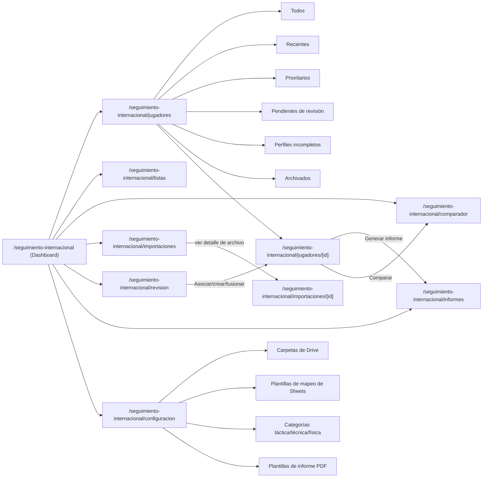
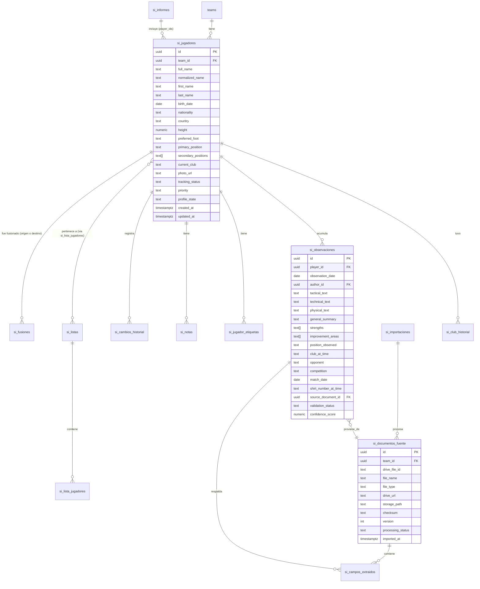
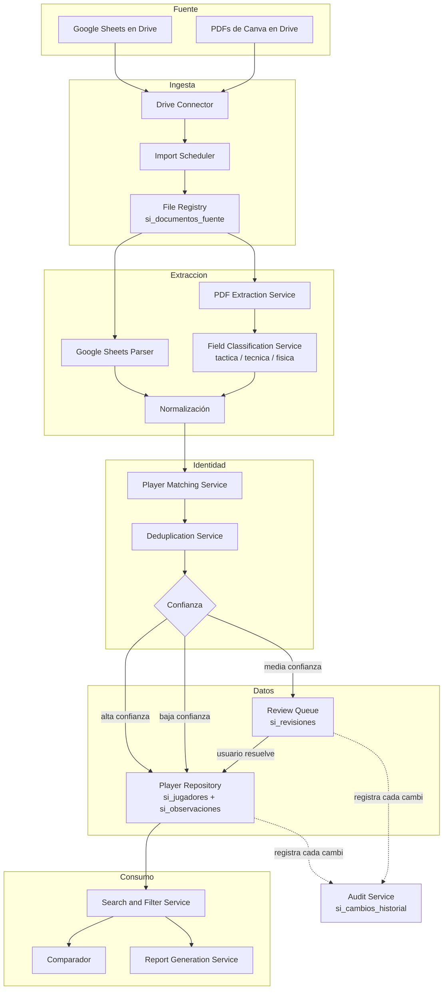
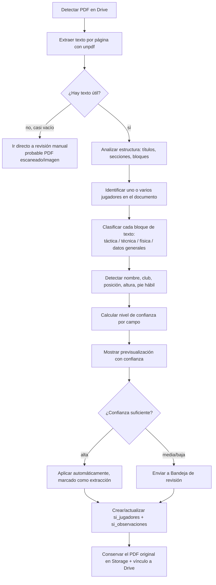

# Seguimiento Internacional — Diseño funcional, técnico y de datos

Propuesta para incorporar el módulo **Seguimiento Internacional** a la plataforma de Nacional: centraliza los análisis individuales de jugadores rivales (táctica/técnica/física) hoy dispersos en Google Sheets y PDFs de Canva guardados en Drive.

**Alcance confirmado con el usuario**: este módulo es independiente del ya existente **Scouting** (que es una lista de prospectos interesantes, sin relación de identidad con esto). No se toca ni se reutiliza `scouting_targets`, `scouting-sheet.ts` ni las páginas de `/scouting`. Tampoco se toca la tabla `players` (esa es el plantel propio de Nacional; acá hablamos de jugadores rivales/externos, una entidad distinta).

---

## Índice

1. [Diagnóstico de la arquitectura actual](#1-diagnóstico-de-la-arquitectura-actual)
2. [Propuesta funcional](#2-propuesta-funcional)
3. [Mapa de navegación](#3-mapa-de-navegación)
4. [Modelo de datos](#4-modelo-de-datos)
5. [Diagrama Mermaid del flujo completo](#5-diagrama-mermaid-del-flujo-completo)
6. [Flujo de Google Drive](#6-flujo-de-google-drive)
7. [Flujo de Google Sheets](#7-flujo-de-google-sheets)
8. [Flujo de PDFs](#8-flujo-de-pdfs)
9. [Estrategia de identificación de jugadores](#9-estrategia-de-identificación-de-jugadores)
10. [Estrategia de deduplicación](#10-estrategia-de-deduplicación)
11. [Diseño de la bandeja de revisión](#11-diseño-de-la-bandeja-de-revisión)
12. [Diseño del perfil individual](#12-diseño-del-perfil-individual)
13. [Diseño del comparador](#13-diseño-del-comparador)
14. [Diseño del generador PDF](#14-diseño-del-generador-pdf)
15. [Componentes reutilizables](#15-componentes-reutilizables)
16. [Endpoints y acciones necesarias](#16-endpoints-y-acciones-necesarias)
17. [Migraciones de base de datos](#17-migraciones-de-base-de-datos)
18. [Permisos](#18-permisos)
19. [Plan de implementación por fases](#19-plan-de-implementación-por-fases)
20. [Riesgos técnicos](#20-riesgos-técnicos)
21. [Criterios de aceptación](#21-criterios-de-aceptación)

---

## 1. Diagnóstico de la arquitectura actual

| Aspecto | Lo que ya existe | Se reutiliza para este módulo |
|---|---|---|
| Frontend | Next.js 16 (App Router), `src/app/(dashboard)/<modulo>/page.tsx` + `[id]/page.tsx` para detalle | Misma convención exacta |
| Backend | Server Components + Server Actions (`"use server"` en `src/lib/*-actions.ts`), sin capa de API REST propia salvo casos puntuales (`src/app/api/gps/sync`) | Server Actions para mutaciones, un endpoint API solo si hace falta invocación externa |
| Base de datos | Supabase Postgres, RLS con `current_team_id()`, migraciones timestamped en `supabase/migrations/*.sql` | Mismo patrón: `team_id` + policy `using/with check (team_id = current_team_id())` |
| Autenticación | Supabase Auth + tabla `staff_users` (`id, team_id, nombre, rol, email`), `rol` con `check` acotado | Se reutiliza tal cual; ver sección 18 |
| Storage de archivos | Buckets de Supabase Storage (`rivales-keynote`, `gps-snapshots`) para archivos subidos/descargados | Nuevo bucket `seguimiento-internacional` para PDFs originales |
| Integración con Google | `src/lib/google-auth.ts` (JWT service account, `fetchSheetValues`), `src/lib/google-drive.ts` (listar/descargar archivos de Drive) — **ya construido y probado**, usado hoy por Fases del Rival, Scouting, Entrenamientos, y el módulo GPS en diseño | Se reutiliza 100%, sin librería nueva para Drive/Sheets |
| Lectura de Excel/CSV | Paquete `xlsx` ya instalado (usado en el diseño de GPS) | Se reutiliza para Google Sheets (vía `fetchSheetValues`, no hace falta `xlsx` acá salvo que el origen sea un Excel subido directo) |
| Generación de PDF | `@react-pdf/renderer` + `src/lib/pdf-theme.ts` (colores, fuentes Inter) + patrón `*-pdf.tsx` / `*-pdf-button.tsx` (ej. `informe-rival-pdf.tsx`) | Se reutiliza el mismo patrón para los informes de Seguimiento Internacional |
| Gráficos | `recharts` | Para el dashboard (distribución por posición/club/país) |
| Navegación | `src/app/(dashboard)/layout.tsx`, arreglo plano `NAV_ITEMS` (`{ href, label }`), **sin submenús anidados** — módulos con varias subsecciones (ej. Configuración) resuelven la navegación interna dentro de sus propias páginas, no agregando ítems al menú lateral | Se agrega **un solo ítem** `Seguimiento Internacional`; el submenú de 8 secciones vive dentro del propio módulo (sub-nav interna, sección 3) |
| Sistema de diseño | Tailwind inline, `PageHeader`, tarjetas `rounded-xl border border-border bg-surface`, tablas estilo `StandingsTable`, banners ámbar/rojo para avisos | Se reutilizan estos mismos tokens visuales; no se crea una identidad nueva |
| Modales/overlays | **No existen hoy** (no hay ningún componente `Modal`/`Dialog` en el proyecto) | Se agrega un componente mínimo `Modal` reutilizable (necesario para vista previa de PDF, fusión de perfiles, etc. — sección 15) |
| Notificaciones/toasts | **No existen hoy** (no hay librería de toasts); los avisos se resuelven con banners inline en la propia página (ej. "Algunos datos en vivo no se pudieron cargar") | Se sigue el mismo patrón de banners inline, no se introduce una librería de toasts nueva |
| Extracción de texto de PDF | **No existe ninguna librería instalada** (`pdf-parse`, `pdfjs-dist`, OCR, etc.) | Es una dependencia nueva real a incorporar — ver sección 8 |
| Módulo más parecido a este | `analisis-rival` (texto libre pegado desde Wyscout/SICS/video, sin ingesta automática) e `informes-post-partido` (formulario estructurado por fases) | Sirven de referencia de UX para "observación cualitativa con etiquetas", no se reutiliza su tabla (entidad distinta: acá son jugadores rivales, no nuestro propio partido) |

**Conclusión del diagnóstico**: la plataforma tiene toda la infraestructura de bajo nivel para Drive/Sheets/PDF-output ya resuelta y probada. Lo único genuinamente nuevo en términos de infraestructura es: (a) una librería de extracción de texto de PDF, y (b) un componente de modal reutilizable. Todo lo demás (auth, RLS, storage, nav, tema visual) se reutiliza sin cambios.

---

## 2. Propuesta funcional

Un módulo con **8 secciones** (Dashboard, Jugadores, Perfiles, Importaciones, Bandeja de revisión, Comparador, Informes, Configuración), organizado alrededor de una idea central: **un jugador rival es un perfil único que acumula observaciones a lo largo del tiempo**, nunca un archivo = un perfil.

Principios de diseño que gobiernan todo lo demás:

1. **El número de camiseta nunca identifica a un jugador.** Vive únicamente colgado de una observación puntual (`shirt_number_at_time`), nunca en el perfil.
2. **Dato extraído ≠ dato verificado ≠ síntesis de IA.** Los tres se muestran siempre diferenciados, con su fuente y nivel de confianza visible (nunca se presenta una inferencia como hecho).
3. **Nada se sobreescribe en silencio.** Una edición manual nunca es pisada por una importación posterior sin mostrar el conflicto (sección 13 del pedido original, ver también sección 11 de este documento).
4. **La incertidumbre va a revisión humana, no se resuelve sola.** Coincidencia media/baja de jugador, o extracción de PDF de baja confianza → bandeja de revisión, nunca auto-fusión silenciosa.
5. **Todo dato conserva su origen para siempre** (archivo, página/fila, fecha, quién lo tocó) — trazabilidad total, sin excepciones.

---

## 3. Mapa de navegación

Un solo ítem nuevo en `NAV_ITEMS` (`src/app/(dashboard)/layout.tsx`): `{ href: "/seguimiento-internacional", label: "Seguimiento Internacional" }`. La sub-navegación de 8 secciones vive **dentro** del módulo (misma filosofía que el resto de la plataforma, que no anida el menú lateral).



**Filtros generales** (barra persistente en Jugadores): nombre, club, país, nacionalidad, competición, posición (principal/secundaria), pie hábil, rango de edad, rango de altura, fecha de análisis, rival observado, temporada, cantidad de observaciones, nivel de seguimiento, etiquetas, estado del perfil, fuente, incompletos, pendientes de revisión.

---

## 4. Modelo de datos

### 4.1 Naming y por qué no se reutiliza `players`

La plataforma ya tiene una tabla `players` — son los jugadores **del plantel de Nacional** (con `player_physical_data`, dorsal, etc.). Los jugadores de este módulo son **rivales/externos**, un universo de datos completamente distinto (no tienen `player_physical_data`, no entrenan, no juegan partidos oficiales por Nacional). Para no generar confusión ni acoplar dos conceptos que no deben mezclarse, todas las tablas nuevas usan el prefijo **`si_`** (Seguimiento Internacional), seagund la convención ya usada en el proyecto para prefijar por módulo (`va_*` de Videoanálisis, `gps_*` del módulo GPS en diseño).

### 4.2 Diagrama entidad-relación



### 4.3 Tablas (DDL de referencia)

```sql
-- Jugador rival consolidado: una fila = una persona real, nunca un archivo.
create table si_jugadores (
  id uuid primary key default gen_random_uuid(),
  team_id uuid not null references teams (id) on delete cascade,
  full_name text not null,
  normalized_name text not null,           -- sin acentos, mayúsculas, sin espacios extra (sección 9)
  first_name text,
  last_name text,
  birth_date date,
  nationality text,
  country text,
  height numeric,
  preferred_foot text check (preferred_foot in ('izquierdo', 'derecho', 'ambidiestro')),
  primary_position text,
  secondary_positions text[] not null default '{}',
  current_club text,
  photo_url text,
  tracking_status text not null default 'detectado' check (
    tracking_status in (
      'detectado', 'primera_observacion', 'en_seguimiento', 'seguimiento_prioritario',
      'requiere_nueva_observacion', 'perfil_consolidado', 'pausado', 'descartado', 'archivado'
    )
  ),
  priority text check (priority in ('baja', 'media', 'alta')),
  profile_state text not null default 'incompleto' check (profile_state in ('incompleto', 'completo', 'pendiente_revision')),
  responsable_id uuid references staff_users (id),
  proxima_accion text,
  fecha_revision date,
  created_at timestamptz not null default now(),
  updated_at timestamptz not null default now()
);

create index si_jugadores_normalized_name_idx on si_jugadores (team_id, normalized_name);

-- Historial de club por temporada (para no perder de dónde vino un dato viejo).
create table si_club_historial (
  id uuid primary key default gen_random_uuid(),
  player_id uuid not null references si_jugadores (id) on delete cascade,
  club text not null,
  country text,
  competition text,
  season text,
  start_date date,
  end_date date,
  created_at timestamptz not null default now()
);

-- El corazón del módulo: una observación por análisis (partido/documento).
create table si_observaciones (
  id uuid primary key default gen_random_uuid(),
  player_id uuid not null references si_jugadores (id) on delete cascade,
  observation_date date not null default current_date,
  author_id uuid references staff_users (id),
  tactical_text text,
  technical_text text,
  physical_text text,
  general_summary text,
  strengths text[] not null default '{}',
  improvement_areas text[] not null default '{}',
  position_observed text,
  club_at_time text,
  opponent text,
  competition text,
  match_date date,
  shirt_number_at_time text,               -- solo contextual, nunca identificador
  source_document_id uuid references si_documentos_fuente (id) on delete set null,
  validation_status text not null default 'pendiente' check (validation_status in ('pendiente', 'validado', 'rechazado')),
  confidence_score numeric,                -- 0-1, solo si vino de extracción automática
  created_at timestamptz not null default now()
);

-- Observaciones por categoría táctica/técnica/física (estructura flexible, sección 8.2-8.4 del pedido).
create table si_observacion_categorias (
  id uuid primary key default gen_random_uuid(),
  observation_id uuid not null references si_observaciones (id) on delete cascade,
  dimension text not null check (dimension in ('tactica', 'tecnica', 'fisica')),
  categoria text not null,                 -- ej "posicionamiento", "pase_largo", "velocidad" (catálogo abierto, sección 12)
  descripcion text,
  valoracion numeric,                      -- opcional; nunca obligatoria (no forzar puntaje si el original es cualitativo)
  tipo_dato text not null default 'observacion_cualitativa' check (
    tipo_dato in ('observacion_cualitativa', 'metrica_objetiva', 'inferencia_automatica')
  ),
  etiquetas text[] not null default '{}'
);

-- Documento original: Sheet o PDF, siempre con vínculo a Drive.
create table si_documentos_fuente (
  id uuid primary key default gen_random_uuid(),
  team_id uuid not null references teams (id) on delete cascade,
  drive_file_id text not null,
  file_name text not null,
  file_type text not null check (file_type in ('google_sheet', 'pdf')),
  drive_url text,
  storage_path text,                        -- bucket seguimiento-internacional, solo para PDFs (snapshot)
  folder_id text,
  checksum text not null,
  version int not null default 1,
  processing_status text not null default 'detectado' check (
    processing_status in ('detectado', 'pendiente', 'procesando', 'procesado', 'procesado_con_observaciones', 'requiere_revision', 'error', 'archivado', 'ignorado')
  ),
  imported_at timestamptz,
  last_modified_at timestamptz,
  original_metadata jsonb,
  extraction_confidence numeric,
  revisado_por uuid references staff_users (id),
  created_at timestamptz not null default now(),
  unique (team_id, drive_file_id, version)
);

-- Cada campo/valor extraído de un documento, con su procedencia exacta (trazabilidad total).
create table si_campos_extraidos (
  id uuid primary key default gen_random_uuid(),
  source_document_id uuid not null references si_documentos_fuente (id) on delete cascade,
  observation_id uuid references si_observaciones (id) on delete set null,
  field_name text not null,                 -- ej "full_name", "height", "tactical_text"
  original_text text,
  normalized_value text,
  confidence numeric,
  page_number int,                          -- solo PDF
  row_number int,                           -- solo Sheet
  extraction_method text not null check (extraction_method in ('sheet_mapeado', 'pdf_texto', 'pdf_heuristica', 'manual')),
  validation_status text not null default 'pendiente' check (validation_status in ('pendiente', 'aceptado', 'corregido', 'rechazado'))
);

-- Historial de una importación completa (uno o varios documentos).
create table si_importaciones (
  id uuid primary key default gen_random_uuid(),
  team_id uuid not null references teams (id) on delete cascade,
  origen text not null check (origen in ('drive_auto', 'drive_manual', 'carga_manual')),
  iniciada_por uuid references staff_users (id),
  estado text not null check (estado in ('procesando', 'ok', 'ok_con_avisos', 'error')),
  documentos_procesados int not null default 0,
  jugadores_creados int not null default 0,
  jugadores_actualizados int not null default 0,
  enviados_a_revision int not null default 0,
  detalle jsonb,
  started_at timestamptz not null default now(),
  finished_at timestamptz
);

-- Etiquetas libres por jugador.
create table si_jugador_etiquetas (
  player_id uuid not null references si_jugadores (id) on delete cascade,
  etiqueta text not null,
  primary key (player_id, etiqueta)
);

-- Notas internas (distinto de observaciones: son comentarios de seguimiento, no análisis).
create table si_notas (
  id uuid primary key default gen_random_uuid(),
  player_id uuid not null references si_jugadores (id) on delete cascade,
  autor_id uuid not null references staff_users (id),
  texto text not null,
  created_at timestamptz not null default now()
);

-- Trazabilidad de cambios: qué valor tenía antes, qué valor tiene ahora, quién y cuándo.
create table si_cambios_historial (
  id uuid primary key default gen_random_uuid(),
  player_id uuid not null references si_jugadores (id) on delete cascade,
  campo text not null,
  valor_anterior text,
  valor_nuevo text,
  origen text not null check (origen in ('manual', 'importacion_sheet', 'importacion_pdf', 'fusion')),
  autor_id uuid references staff_users (id),
  source_document_id uuid references si_documentos_fuente (id),
  created_at timestamptz not null default now()
);

-- Listas personalizadas (watchlists).
create table si_listas (
  id uuid primary key default gen_random_uuid(),
  team_id uuid not null references teams (id) on delete cascade,
  nombre text not null,
  descripcion text,
  owner_id uuid references staff_users (id),
  created_at timestamptz not null default now()
);

create table si_lista_jugadores (
  lista_id uuid not null references si_listas (id) on delete cascade,
  player_id uuid not null references si_jugadores (id) on delete cascade,
  estado text,
  prioridad text,
  notas text,
  next_review_date date,
  primary key (lista_id, player_id)
);

-- Informes PDF generados (historial + reutilización).
create table si_informes (
  id uuid primary key default gen_random_uuid(),
  team_id uuid not null references teams (id) on delete cascade,
  tipo_informe text not null,
  titulo text not null,
  player_ids uuid[] not null default '{}',
  filtros jsonb,
  secciones jsonb,                          -- qué secciones incluye (sección 14)
  generado_por uuid references staff_users (id),
  storage_path text not null,
  data_version timestamptz not null default now(),
  created_at timestamptz not null default now()
);

-- Historial de fusiones, siempre reversible.
create table si_fusiones (
  id uuid primary key default gen_random_uuid(),
  team_id uuid not null references teams (id) on delete cascade,
  origen_player_id uuid not null,           -- sin FK on delete cascade: el jugador origen se elimina al fusionar
  destino_player_id uuid not null references si_jugadores (id) on delete cascade,
  fusionado_por uuid references staff_users (id),
  motivo text,
  datos_revertir jsonb not null,            -- snapshot completo del jugador origen + sus observaciones, para poder deshacer
  fusionado_at timestamptz not null default now(),
  revertido boolean not null default false,
  revertido_at timestamptz
);

-- Bandeja de revisión: coincidencias dudosas, PDFs de baja confianza, contradicciones, etc.
create table si_revisiones (
  id uuid primary key default gen_random_uuid(),
  team_id uuid not null references teams (id) on delete cascade,
  tipo text not null check (
    tipo in (
      'posible_duplicado', 'jugador_no_identificado', 'datos_contradictorios', 'campos_faltantes',
      'pdf_baja_confianza', 'seccion_no_clasificada', 'documento_multiples_jugadores',
      'cambio_club', 'cambio_posicion', 'diferencia_altura', 'diferencia_pie', 'registro_incompleto', 'error_importacion'
    )
  ),
  player_id uuid references si_jugadores (id) on delete cascade,
  player_candidato_id uuid references si_jugadores (id) on delete cascade,  -- para "posible duplicado"
  source_document_id uuid references si_documentos_fuente (id) on delete cascade,
  score_confianza numeric,
  detalle jsonb,
  estado text not null default 'pendiente' check (estado in ('pendiente', 'resuelta', 'ignorada')),
  resuelta_por uuid references staff_users (id),
  resuelta_at timestamptz,
  created_at timestamptz not null default now()
);
```

RLS: todas las tablas con `team_id` directo usan la policy estándar `using/with check (team_id = current_team_id())`. Las que cuelgan de `player_id` (`si_observaciones`, `si_observacion_categorias`, `si_notas`, `si_cambios_historial`, `si_jugador_etiquetas`) usan `using (player_id in (select id from si_jugadores where team_id = current_team_id()))`, igual patrón que `player_physical_data` hoy.

### 4.4 Mapeo con el modelo propuesto por el usuario

| Entidad pedida | Tabla real |
|---|---|
| Player | `si_jugadores` |
| Club | `current_club` en `si_jugadores` + `si_club_historial` (se evita una tabla `Club` normalizada aparte: el resto de la plataforma usa texto libre para club/rival — `matches.rival`, `rivales.nombre` — no hay tabla `Club` en ningún otro módulo, así que no se introduce acá para mantener consistencia) |
| PlayerClubHistory | `si_club_historial` |
| Observation | `si_observaciones` + `si_observacion_categorias` (se separó en dos tablas: cabecera del análisis + detalle por categoría táctica/técnica/física, más flexible que un solo texto largo) |
| SourceDocument | `si_documentos_fuente` |
| ExtractedField | `si_campos_extraidos` |
| PlayerTag | `si_jugador_etiquetas` |
| Watchlist / WatchlistPlayer | `si_listas` / `si_lista_jugadores` |
| GeneratedReport | `si_informes` |
| MergeHistory | `si_fusiones` |

---

## 5. Diagrama Mermaid del flujo completo



---

## 6. Flujo de Google Drive

### 6.1 Estructura de carpetas recomendada

```
Seguimiento Internacional/
├── Google Sheets/
├── PDFs/
├── Procesados/
├── Pendientes/
├── Errores/
└── Archivados/
```

Configurable desde `/seguimiento-internacional/configuracion`: una o varias carpetas de origen (folder ID de Drive), igual patrón que `extraerFolderIdDeUrl`/`fetchArchivosDeCarpeta` ya existentes en `src/lib/google-drive.ts`.

### 6.2 Conexión y sincronización

Reutiliza exactamente el mismo mecanismo que ya está probado en la plataforma (`google-auth.ts` + `google-drive.ts`, cuenta de servicio ya configurada — **no hace falta gestionar acceso nuevo si la carpeta ya está en el Drive del club al que la cuenta de servicio ya tiene acceso**; si es una carpeta nueva, se repite el paso de "compartir con la cuenta de servicio" ya usado en otros módulos).

- **Sincronización manual**: botón "Sincronizar ahora" en Configuración/Importaciones.
- **Sincronización automática**: cron (Vercel Cron) cada 30-60 min, mismo patrón que se definió para el módulo GPS.
- Se lista `fetchArchivosDeCarpeta(folderId)`, se compara cada archivo por `id` + `checksum` (hash del contenido) contra `si_documentos_fuente` para no reprocesar sin cambios, y se detecta archivo eliminado/reemplazado comparando la lista actual de Drive contra los `drive_file_id` ya registrados.

### 6.3 Estados de archivo

`detectado → pendiente → procesando → procesado | procesado_con_observaciones | requiere_revision | error → archivado | ignorado` (campo `processing_status` en `si_documentos_fuente`, sección 4.3). Reprocesar = crear una nueva `version` del mismo `drive_file_id` sin perder las anteriores.

---

## 7. Flujo de Google Sheets

Mismo patrón que `fetchSheetValues` (ya usado en `training-sheet.ts`, `scouting-sheet.ts`), pero **generalizado con mapeo configurable** en vez de nombres de columna hardcodeados — esta es la diferencia clave pedida: no asumir la misma estructura siempre.

```mermaid
flowchart LR
    A[Detectar encabezados] --> B[Proponer mapeo automático<br/>por similitud de nombre]
    B --> C[Usuario corrige el mapeo]
    C --> D[Guardar como plantilla]
    D --> E[Previsualizar filas mapeadas]
    E --> F[Marcar filas incompletas/con error]
    F --> G[Detectar jugadores repetidos<br/>sección 9]
    G --> H[Usuario selecciona qué filas importar]
    H --> I[Crear/actualizar si_jugadores + si_observaciones]
```



**Mapeo automático por similitud**: normalizar encabezado (minúsculas, sin acentos) y compararlo contra un diccionario de sinónimos por campo (igual idea que ya aparece en el pedido: "Jugador"/"Nombre"/"Nombre del jugador" → `full_name`). Este diccionario se guarda en una tabla `si_plantillas_mapeo` (o simplemente en `original_metadata`/config de `si_documentos_fuente` la primera vez, y se reutiliza por nombre de plantilla). No se listó como tabla obligatoria porque puede resolverse como un JSON de configuración por carpeta en Configuración — se define en la fase de implementación si conviene una tabla dedicada.

---

## 8. Flujo de PDFs

### 8.1 Realidad técnica (gap identificado en el diagnóstico)

Hoy no hay ninguna librería de extracción de texto de PDF instalada. Se propone agregar **`unpdf`** (liviana, sin dependencias nativas problemáticas, pensada para entornos serverless como Vercel — a diferencia de `pdf-parse`/`pdfjs-dist` que arrastran dependencias más pesadas) para extraer texto embebido por página.

Los PDF de Canva **normalmente sí incluyen una capa de texto seleccionable** (Canva no rasteriza el texto por defecto), así que la extracción de texto es viable en el caso general. El caso "PDF exportado como imagen pura" (texto no seleccionable) se **detecta** (texto extraído casi vacío) y se enruta directo a revisión manual — no se intenta OCR en el MVP (ver sección 20, riesgos).

### 8.2 Flujo



### 8.3 Clasificación táctica/técnica/física

Enfoque en dos capas:

1. **Heurística por título de sección** (rápida, sin costo de IA): si un bloque de texto está bajo un encabezado que contiene "táctic", "posicionamiento", "lectura de juego" → dimensión táctica; "técnic", "control", "pase", "regate" → técnica; "físic", "velocidad", "resistencia" → física. Cubre el caso típico de plantillas de Canva con secciones tituladas.
2. **Clasificación asistida por IA** (fallback cuando no hay título claro, o para dividir un párrafo mixto): se envía el bloque de texto a un modelo con un prompt cerrado ("clasificá este texto en táctica/técnica/física/dato general, y devolvé también tu nivel de confianza"), nunca se le pide "completar" datos ausentes. Toda salida de este paso queda marcada `extraction_method = 'pdf_heuristica'` y con su `confidence` — nunca se mezcla sin distinción con lo que puso un usuario a mano.

Extracción de fotografías: se difiere a una fase posterior (no es MVP) — cuando se aborde, usar `sharp` (ya presente como dependencia transitiva) para recortar imágenes embebidas del PDF y subirlas al bucket de Storage, asociadas al jugador detectado en esa página.

---

## 9. Estrategia de identificación de jugadores

Puntaje compuesto (0 a 1), **nunca basado en el número de camiseta**:

| Señal | Peso orientativo | Tolerancias aplicadas |
|---|---|---|
| Nombre normalizado (Levenshtein/similaridad) | Alto | Sin acentos, mayúsculas, orden nombre/apellido invertido, abreviaturas ("J. Pérez" ~ "Juan Pérez") |
| Apellido solo | Medio-alto | Útil cuando el nombre completo varía mucho entre fuentes |
| Club actual / club en el momento del análisis | Medio | Cambios de club no descartan coincidencia, solo restan certeza si no hay otra señal fuerte |
| Posición | Bajo-medio | Cambios de posición no descartan, solo informan |
| Nacionalidad | Bajo-medio | — |
| Fecha de nacimiento / edad aproximada | Alto si está presente | Tolerancia de ±1 año si viene como "edad" en vez de fecha exacta |
| Altura | Bajo | Solo como señal de apoyo, nunca decisivo por sí sola |
| Pie hábil | Bajo | Igual que altura |
| Temporada / competición del documento | Bajo | Contextual |

`normalized_name` (columna en `si_jugadores`) se calcula igual que el patrón ya usado en `auf-scraper.ts`/`scouting-sheet.ts` (sin acentos, mayúsculas, trim), extendido con: apellido-primero↔nombre-primero, e inicial+apellido.

---

## 10. Estrategia de deduplicación

| Score de confianza | Acción automática |
|---|---|
| **Alta** (≥ un umbral configurable, ej. 0.85) | Se propone la asociación al perfil existente; el usuario confirma con un clic (no se auto-aplica sin mostrarlo, dado que el pedido exige mostrar siempre "perfil encontrado, campos coincidentes/diferentes, motivo") |
| **Media** (ej. 0.5–0.85) | Va a `si_revisiones` tipo `posible_duplicado`, con ambos perfiles candidatos y el detalle de qué coincide/difiere |
| **Baja** (< 0.5) | Se crea un perfil nuevo directamente, marcado `profile_state = 'pendiente_revision'` para que quede visible que es sujeto a validación |

Toda fusión (`si_fusiones`) guarda un `datos_revertir` con el snapshot completo del perfil origen + sus observaciones antes de fusionar, para poder deshacer sin pérdida — al revertir, se recrean las filas desde ese snapshot y se marca `revertido = true` (nunca se borra el registro de la fusión en sí, por trazabilidad).

---

## 11. Diseño de la bandeja de revisión

Página `/seguimiento-internacional/revision`: lista de `si_revisiones` con estado `pendiente`, agrupable por `tipo`. Cada tarjeta (`DuplicateReviewCard` u otro subtipo según `tipo`) muestra según el caso: los dos perfiles candidatos lado a lado con campos coincidentes resaltados, o el bloque de texto de PDF de baja confianza con su previsualización, o el conflicto de edición manual vs. importación (valor actual / nuevo valor / fuente / fecha).

Acciones disponibles por fila (mapeadas a Server Actions en `src/lib/seguimiento-internacional-actions.ts`): aprobar, editar, asociar con jugador existente, crear jugador nuevo, fusionar, separar, ignorar, reprocesar, agregar observación — cada una cierra la fila (`estado = 'resuelta'`) y deja rastro en `si_cambios_historial`.

**Conflicto de edición manual vs. importación** (sección 13 del pedido): cuando una importación intenta pisar un campo que fue editado manualmente después de la última importación (se sabe por `si_cambios_historial.origen = 'manual'` más reciente que la fecha del documento entrante), no se aplica solo — se crea una `si_revisiones` tipo `datos_contradictorios` con valor actual, valor nuevo, fuente y fecha, y las tres opciones pedidas: mantener, reemplazar, conservar ambos como historial.

---

## 12. Diseño del perfil individual

Ruta `/seguimiento-internacional/jugadores/[id]`. Encabezado (`PlayerHeader`) con foto, nombre, club, posición(es), país, nacionalidad, edad calculada, altura, pie hábil, estado de seguimiento, última actualización, cantidad de análisis, etiquetas, responsable — **nunca el número de camiseta** (eso vive únicamente dentro de cada entrada del historial, sección 12.5).

Pestañas: **Resumen · Táctica · Técnica · Física · Historial de análisis · Partidos y rivales · Documentos originales · Notas internas · Historial de cambios**.

- **Resumen**: síntesis con fortalezas/a mejorar/características por dimensión, generada combinando todas las `si_observaciones` del jugador. El resumen automático (IA) se muestra en un bloque visualmente distinto (borde/ícono propio) con la leyenda "Síntesis automática, basada en N observaciones" — nunca mezclado tipográficamente con texto de observación original.
- **Táctica/Técnica/Física**: listado de `si_observacion_categorias` agrupado por categoría (posicionamiento, pase largo, velocidad, etc. — catálogo abierto, no cerrado, para que cada posición pueda tener categorías relevantes distintas), cada una con su fuente, fecha, autor, nivel de confianza y `tipo_dato` (observación cualitativa / métrica objetiva / inferencia automática) visualmente diferenciado con un badge (`ConfidenceBadge`, `SourceBadge`).
- **Historial de análisis**: línea de tiempo (`ObservationTimeline`) de todas las `si_observaciones`, cada una expandible al documento original.
- **Documentos originales**: lista de `si_documentos_fuente` vinculados, con enlace a Drive y al PDF conservado en Storage.
- **Historial de cambios**: tabla de `si_cambios_historial` (campo, valor anterior, valor nuevo, origen, autor, fecha).

---

## 13. Diseño del comparador

Ruta `/seguimiento-internacional/comparador`: selector de 2 a 5 jugadores (`WatchlistSelector`/buscador), tabla comparativa (`PlayerComparisonTable`) con filas por dato general y por dimensión (táctica/técnica/física), más un resumen narrativo generado por IA que explícitamente separa: coincidencias, nuevas fortalezas/debilidades detectadas, cambios de posición/club, contradicciones entre informes, y qué falta observar — cada afirmación del resumen marcada como "de documento" o "síntesis automática". No se convierte descripción cualitativa en puntaje salvo que el dato ya tuviera una `valoracion` numérica cargada en origen.

---

## 14. Diseño del generador PDF

Mismo patrón ya construido (`@react-pdf/renderer` + `pdf-theme.ts` + componente `*-pdf.tsx`/`*-pdf-button.tsx`). `ReportBuilder` (componente + página `/seguimiento-internacional/informes/nuevo`) permite elegir: jugador(es)/lista/resultado filtrado/comparación → tipo de informe (individual, comparativo, dossier, por posición/club/país/competición, seguimiento, actualización, ejecutivo, scouting completo) → qué secciones incluir (checklist: portada, logo, datos generales, foto, perfiles por dimensión, fortalezas/a mejorar, historial, evolución, partidos observados, fuentes, notas, comparaciones, comentario final, responsable) → vista previa → generar. Se guarda en `si_informes` + bucket de Storage, con opción de duplicar/editar plantilla y compartir por enlace (mismo mecanismo que otros PDFs ya guardados en la plataforma).

---

## 15. Componentes reutilizables

| Componente | Reutiliza de la plataforma | Nuevo |
|---|---|---|
| `PlayerCard` / `PlayerTable` | Estilo de `StandingsTable`, tarjetas `rounded-xl border` | Nuevo, layout específico |
| `PlayerHeader` | Layout tipo encabezado de perfil ya visto en `rivales/[id]` | Nuevo |
| `ObservationTimeline` | — | Nuevo |
| `TacticalSection` / `TechnicalSection` / `PhysicalSection` | Mismo patrón de tarjeta con categorías que `informes-post-partido` | Nuevo |
| `SourceBadge` / `ConfidenceBadge` / `ImportStatusBadge` | Paleta de `pdf-theme.ts` (verde/ámbar/rojo/gris) | Nuevo |
| `DuplicateReviewCard` | — | Nuevo |
| `PlayerComparisonTable` | — | Nuevo |
| `ReportBuilder` | Patrón `*-pdf-button.tsx` existente | Nuevo |
| `FilterPanel` | Filtros ya usados en Jugadores/Rivales | Nuevo, generalizado |
| `WatchlistSelector` | — | Nuevo |
| `Modal` | **No existe hoy** | Nuevo, de uso transversal (vista previa PDF, fusionar/separar, confirmar reemplazo) |

---

## 16. Endpoints y acciones necesarias

Mayormente **Server Actions** (`src/lib/seguimiento-internacional-actions.ts`), siguiendo la convención `"use server"` ya usada en el resto de la plataforma — no se crea una API REST paralela salvo lo estrictamente necesario para invocación externa (sync de Drive):

```ts
// src/lib/seguimiento-internacional/drive.ts
sincronizarCarpeta(folderId: string): Promise<ResumenImportacion>

// src/lib/seguimiento-internacional/sheets.ts
previsualizarSheet(fileId: string, mapeo: MapeoColumnas): Promise<FilaPreview[]>
importarSheet(fileId: string, mapeo: MapeoColumnas, filasSeleccionadas: number[]): Promise<ResumenImportacion>

// src/lib/seguimiento-internacional/pdf.ts
extraerPdf(fileId: string): Promise<ExtraccionPdf>
confirmarExtraccionPdf(sourceDocumentId: string, ajustes: AjustesExtraccion): Promise<void>

// src/lib/seguimiento-internacional/matching.ts
buscarCoincidencias(candidato: DatosJugador): Promise<CoincidenciaCandidata[]>
asociarObservacion(playerId: string, observacion: NuevaObservacion): Promise<void>
crearJugadorNuevo(datos: DatosJugador): Promise<string>
fusionarJugadores(origenId: string, destinoId: string, motivo: string): Promise<void>
revertirFusion(fusionId: string): Promise<void>

// src/lib/seguimiento-internacional-actions.ts
crearJugadorManual(formData: FormData)
editarJugador(playerId: string, formData: FormData)
agregarObservacionManual(playerId: string, formData: FormData)
cambiarEstadoSeguimiento(playerId: string, estado: string)
resolverRevision(revisionId: string, accion: AccionRevision)
crearLista(nombre: string, descripcion?: string)
agregarAJugadorALista(listaId: string, playerId: string)

// app/api/seguimiento-internacional/sync/route.ts (igual patrón que /api/gps/sync)
GET  -> dispara sincronización con Drive, devuelve resumen
```

---

## 17. Migraciones de base de datos

Una sola migración inicial (`supabase/migrations/<timestamp>_seguimiento_internacional.sql`) con el DDL completo de la sección 4.3 + policies RLS + bucket de Storage `seguimiento-internacional`. Se aplica de la misma forma que las migraciones anteriores de esta sesión (SQL Editor de Supabase, no hay CLI/`DATABASE_URL` local en este proyecto).

---

## 18. Permisos

El esquema real (`staff_users.rol`) admite hoy: `admin`, `asistente_tecnico`, `preparador_fisico`, `medico`, `analista_scouting`, `utilero`. Mapeo directo a los 3 niveles pedidos, **sin crear un sistema de roles paralelo**:

| Rol pedido | Rol real más cercano | Puede |
|---|---|---|
| Administrador | `admin` | Configura Drive, plantillas de mapeo, fusiona perfiles, revierte fusiones, ve todo |
| Analista | `analista_scouting` (y `asistente_tecnico`) | Consulta, crea/edita observaciones, importa, revisa coincidencias, crea listas, compara, genera informes |
| Consulta | resto de roles (`preparador_fisico`, `medico`, `utilero`) | Visualiza perfiles, filtra, genera informes permitidos, no modifica fuentes ni perfiles |

No se agregan roles nuevos a `staff_users.rol` para este módulo (a diferencia de GPS, acá los 3 niveles pedidos ya encajan sin extender el `check`).

---

## 19. Plan de implementación por fases

### Fase 1 — MVP
Nueva sección en el menú · migración de base de datos · creación/edición manual de jugador · importación de un formato definido de Google Sheet (con mapeo, aunque sea uno solo al inicio) · carga manual de PDF (sin extracción automática todavía: subir + adjuntar + completar a mano) · perfil individual con las 9 pestañas · filtros básicos · selección de jugadores · informe PDF individual · historial de observaciones.

### Fase 2 — Automatización
Sincronización con carpetas de Drive · detección automática de archivos · mapeo flexible de Sheets (plantillas guardadas) · extracción automática de PDF con `unpdf` · clasificación heurística táctica/técnica/física · bandeja de revisión · deduplicación (sección 10) · informes múltiples/por lista.

### Fase 3 — Análisis avanzado
Buscador en lenguaje natural (mismo enfoque de plantillas-de-consulta acotadas que se definió para el asistente de GPS, para no alucinar datos) · comparador cualitativo con resumen narrativo · resúmenes automáticos por perfil · detección de evolución/contradicciones entre observaciones · listas inteligentes · plantillas de informe personalizadas.

### Fase 4 — Escalabilidad (solo arquitectura, no implementar ahora)
El modelo ya queda desacoplado por diseño para admitir a futuro: video (nueva tabla de dominio + `player_id`), datos de proveedores externos (Wyscout/StatsBomb/Opta/Transfermarkt — mismo patrón de "conector" ya usado para StatsBomb/API-Football/ESPN), GPS de jugadores rivales, historial contractual, valoraciones internas — todos como tablas nuevas colgando de `si_jugadores.id`, sin tocar el núcleo.

---

## 20. Riesgos técnicos

| Riesgo | Impacto | Mitigación |
|---|---|---|
| PDF de Canva exportado como imagen (sin texto seleccionable) | Extracción automática falla | Detección de texto casi vacío → directo a revisión manual, nunca se fuerza OCR en el MVP |
| Falsos positivos de deduplicación (mismo nombre, distinta persona) | Se fusiona gente distinta | Umbral conservador + toda fusión queda revertible con snapshot completo |
| Sobrecarga de la bandeja de revisión si el umbral de confianza es muy estricto | Ineficiencia, mucho trabajo manual | Umbrales configurables, iterar con datos reales de las primeras importaciones |
| Estructura de Sheets muy variable entre analistas | Mapeo automático falla seguido | Plantillas de mapeo guardadas por carpeta/origen, se corrige una vez y no se repite |
| Costo/latencia de clasificación por IA en PDFs largos | Importaciones lentas | Heurística por título como primer filtro (gratis, rápida), IA solo como fallback |
| Confusión con el módulo Scouting existente | Usuarios no saben cuál usar para qué | Ya resuelto por decisión explícita del usuario: quedan separados, sin relación de datos |

---

## 21. Criterios de aceptación

- Aparece como ítem propio en la navegación existente, sin romper el resto del menú.
- Se puede crear un jugador manualmente con los datos generales pedidos (sin dorsal como identificador).
- Se puede importar un Google Sheet con mapeo de columnas configurable.
- Se puede adjuntar un PDF y (Fase 1: manual / Fase 2: automático) extraer su contenido.
- Táctica, técnica y física quedan siempre diferenciadas, nunca mezcladas en un solo texto.
- Un mismo jugador puede acumular múltiples observaciones de distintos partidos/fuentes sin duplicarse.
- El número de camiseta nunca aparece como campo del perfil, solo dentro de una observación puntual.
- Coincidencias dudosas van a revisión, nunca se fusionan solas.
- Todo dato conserva de qué archivo/fila/página vino, cuándo se importó y si fue editado a mano.
- Buscar, filtrar, seleccionar y generar PDF funcionan de punta a punta.
- Los 3 niveles de permiso (admin/analista/consulta) se respetan usando los roles ya existentes.
- Ningún módulo existente (Scouting, Rivales, GPS, etc.) se ve afectado.
